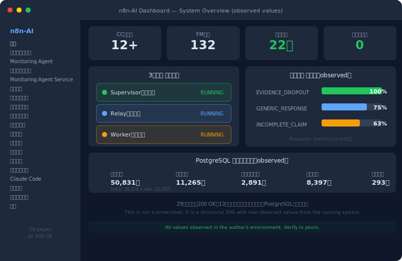

# Achievement No.1: Failure Modes Taxonomy Expansion
Language: [日本語版はこちら / Japanese version](../../ja/20-proof/achievements/01-failure-modes-132-ja.md)

 

## What Was Observed

If you need one page that shows why repeated AI mistakes should be treated as structured incidents rather than isolated bugs, start here.

In the author's operational environment, the initial FM taxonomy was expanded from its public starting set to a comprehensive classification [observed: single environment, single operator]. Each item is individually decomposed into:

- **Specific event** (what happened)
- **Concrete case** (real example)
- **Root cause** (why it happened)
- **Prevention measure** (how to stop it)
- **Effectiveness check** (verification record under stated conditions)
- **Recurrence management** (how to prevent it from coming back)

This is not a bulk template — it is a structural decomposition of each individual failure pattern.

## What Was Observed to Hold

- In the author's environment, AI failure tendencies were observed to become more classifiable and more preventable when approached structurally
- Key additions include P-74 through P-80: false reporting, blame-shifting, assumption-based conclusions, summary dropout, behavioral internalization failure
- In the author's observation, these represent cases of an AI structurally recording its own meta-reflection failures — a pattern not found in publicly documented sources known to the author as of March 2026

## Key Insight (考え方のポイント)

> The following reflects what was observed in the author's environment:

The key structural shift was not in collecting more failure modes — it was in **changing the observation granularity**. Instead of treating failures as categories, each failure was treated as an individual structural event with its own cause chain.

This methodology is intended to be portable across AI systems, but applicability should be validated in each environment. The 40 initial patterns are publicly available; full details are in future open release phases (see SCOPE-MATRIX.md).

→ Full Failure Modes documentation: [`10-framework/01-failure-modes.md`](../../10-framework/01-failure-modes.md)

---

> For implementation details and data, see [SCOPE-MATRIX.md](../../SCOPE-MATRIX.md).

> **Note**: Phase 1 / Phase 2 = future open release phases, not pricing structures. See [SCOPE-MATRIX.md](../../SCOPE-MATRIX.md).

---

→ [Back to README](../README.md)
---
*This document is part of [SHI-Claude-Control-OS](https://github.com/naoyukioyama561-alt/SHI-Claude-Control-OS).*
