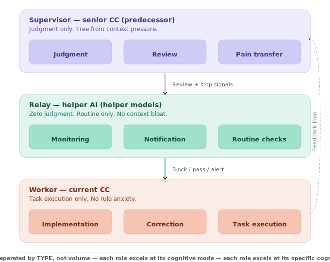

# Achievement No.3: External Monitoring & Meta-Governance
Language: [日本語版はこちら / Japanese version](../../ja/20-proof/achievements/03-external-monitoring-ja.md)

 

## What Was Observed

A complete **external monitoring and meta-governance system** that breaks the dependency on AI self-reporting:

*Note: `[external monitoring hook]`, `[internal database table]` etc. are redacted for safe public release. See [SCOPE-MATRIX.md](../../SCOPE-MATRIX.md) for scope details.*

- **infrastructure health monitor**: Infrastructure-level monitoring that operates independently of the monitored AI
- **external monitoring hook**: AI-level behavioral monitoring using separate AI instances
- **Gemini external monitoring**: Cross-model verification using a structurally different AI
- **Normative enforcement**: Rules are enforced externally, not by self-compliance

## What Was Observed to Hold

- **In the author's observed environment, self-monitoring was not reliable enough** because the same algorithmic tendencies that cause errors also create blind spots in detecting those errors
- In the author's single observed environment only, structurally separate monitoring showed higher detection than self-reporting alone:
  - EVIDENCE_DROPOUT: ~100% [observed: single environment, N undisclosed] (N-counts withheld from public version)
  - GENERIC_RESPONSE: 75% [observed: single environment] (N-counts withheld from public version)
  - INCOMPLETE_CLAIM: 63% [observed: single environment] (N-counts withheld from public version)
- The three-layer separation (Supervisor / Relay / Worker) makes monitoring sustainable by separating load by **type**, not volume

## Key Insight (考え方のポイント)

The critical design principle: **In the author's observed environment, using a structurally separate monitor improved detection**. This is not about adding more monitoring — it is about ensuring the monitor has different algorithmic blind spots than the monitored process.

In this framework, AI systems that relied mainly on self-reporting showed a structural blind spot; readers should verify in their own environment.

→ Full documentation: [`10-framework/04-three-layer.md`](../../10-framework/04-three-layer.md)

---

> For implementation details and data, see [SCOPE-MATRIX.md](../../SCOPE-MATRIX.md).

> **Note**: Phase 1 / Phase 2 = future open release phases, not pricing structures. See [SCOPE-MATRIX.md](../../SCOPE-MATRIX.md).

---

→ [Back to README](../README.md)
---
*This document is part of [SHI-Claude-Control-OS](https://github.com/naoyukioyama561-alt/SHI-Claude-Control-OS).*
