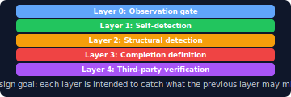

# Achievement No.5: Operational Structure Expansion — 3 → 5 Layers
Language: [日本語版はこちら / Japanese version](../../ja/20-proof/achievements/05-five-layer-ops-ja.md)

  

## What Was Observed

The operational structure was expanded from a conventional 3-layer model to a **5-layer architecture**:

| Layer | Function | What it adds |
|-------|----------|-------------|
| Layer 1 | **Observation** | Observe current state before any action |
| Layer 2 | **Correction** | Self-detect and immediately correct |
| Layer 3 | **Detection** | External hooks/watchers auto-detect and block |
| Layer 4 | **Pre-emptive Control** | Prevent problems before they occur |
| Layer 5 | **Inheritance Lock** | Fix behavioral patterns persistently across sessions |

## What Was Observed to Hold

- A 3-layer model (observe → correct → detect) is insufficient — problems that slip through detection need **pre-emptive control** (stopping them before they happen)
- Even pre-emptive control is insufficient if behavioral improvements are lost on session reset — **inheritance lock** is designed to make corrections persistent
- The 5-layer model creates a complete chain: observe → correct → detect → prevent → lock

## Key Insight (考え方のポイント)

> The following reflects what was observed in the author's environment:

The insight was that **each layer catches what the previous layer misses**, forming a cascading safety net. The critical addition is Layer 5 (Inheritance Lock) — without it, improvements are volatile and disappear on session boundaries.

Think of it as: you can teach an AI to be better, but unless you **lock** that improvement structurally, it resets every session. The 5-layer model makes structural change persistent.

→ Full quality system: [`10-framework/05-quality-system.md`](../../10-framework/05-quality-system.md)

---

> For implementation details and data, see [SCOPE-MATRIX.md](../../SCOPE-MATRIX.md).

---

→ [Back to README](../README.md)
---
*This document is part of [SHI-Claude-Control-OS](https://github.com/naoyukioyama561-alt/SHI-Claude-Control-OS).*
