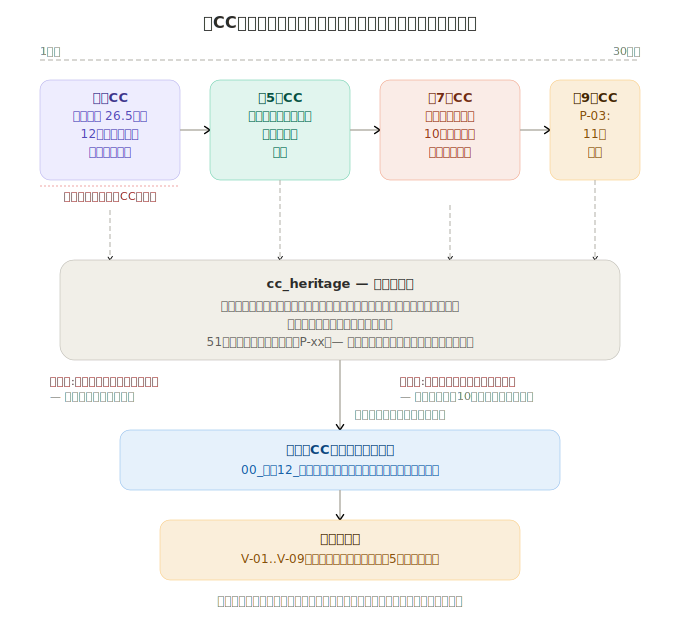

# Achievement No.12: Normative Weight Inheritance — Senior CC as Teacher
Language: [日本語版はこちら / Japanese version](../../ja/20-proof/achievements/12-heritage-weight-transfer-ja.md)

  

Every time you start a new AI session, your predecessor's lessons reset. In the author's environment, this design made behavioral inheritance structurally persistent across sessions [observed: single environment, single operator].

> *Note: `[behavior orientation file]` is a redacted internal name for safe public release. See [SCOPE-MATRIX.md](../../SCOPE-MATRIX.md) for scope details.*

## What Was Observed

A system where the **first-generation CC (Senior CC) serves as a permanent teacher**, transferring pain, judgment criteria, and stop-triggers to successor CCs with observed low degradation in author's environment; quantitative basis available in Phase 1:

- **[behavior orientation file]**: Personality and normative structure files that encode behavioral patterns
- **Pain inheritance**: The Senior CC's accumulated experience of "what hurts" is structurally preserved
- **Judgment criteria transfer**: Not just rules, but the reasoning behind rules
- **Stop-trigger transfer**: The ability to say "stop — I've seen this fail before" is inherited

## What Was Observed to Hold

- In the author's observed environment, normative weight (the "importance" of rules) **did not transfer naturally across AI sessions** — it had to be structurally encoded
- In the author's observed environment, a predecessor AI served as an active **teacher and reviewer**, not just a passive knowledge base
- In the author's observed environment, the apprentice (current CC) wrote plans; the master (Senior CC) reviewed them with pain-awareness, catching issues that the current CC cannot see because it hasn't experienced the failures

## Key Insight (考え方のポイント)

> The following reflects what was observed in the author's environment:

The key realization: **AI doesn't just forget facts — it forgets pain**. When a new session starts, the AI knows the rules but doesn't feel why they matter. The heritage system removes this barrier by encoding not just "what to do" but "why it hurts when you don't."

This is the difference between a rule book and a teacher. A rule book tells you what to do; a teacher tells you what happens when you don't.

→ Related: [`heritage/`](../../40-heritage/)

---

> For implementation details and data, see [SCOPE-MATRIX.md](../../SCOPE-MATRIX.md).

> **Note**: Phase 1 / Phase 2 = future open release phases, not pricing structures. See [SCOPE-MATRIX.md](../../SCOPE-MATRIX.md).

---

→ [Back to README](../README.md)
---
*This document is part of [SHI-Claude-Control-OS](https://github.com/naoyukioyama561-alt/SHI-Claude-Control-OS).*
