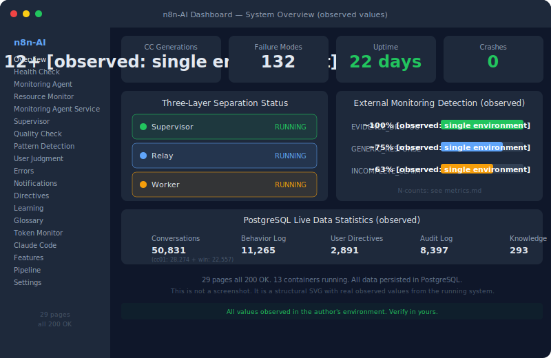

# Achievement No.1: Failure Modes Taxonomy — 40 → 132 Items

  

## What Was Observed

The initial 40-item Failure Modes Taxonomy was expanded to **132 items** (P-series 90 + ALGO-series 40 + ALGO-FW + QUAL-01). Each item is individually decomposed into:

- **Specific event** (what happened)
- **Concrete case** (real example)
- **Root cause** (why it happened)
- **Prevention measure** (how to stop it)
- **Effectiveness verification** (proof it works)
- **Recurrence management** (how to prevent it from coming back)

This is not a bulk template — it is a structural decomposition of each individual failure pattern.

## What Was Observed to Hold

- AI failure tendencies are **observable, classifiable, and preventable** when approached structurally
- Key additions include P-74 through P-80: false reporting, blame-shifting, assumption-based conclusions, summary dropout, behavioral internalization failure
- These represent cases with no publicly documented precedent known to the authors of an AI **structurally recording its own meta-reflection failures**

## Key Insight (考え方のポイント)

The key structural shift was not in collecting more failure modes — it was in **changing the observation granularity**. Instead of treating failures as categories, each failure was treated as an individual structural event with its own cause chain.

This methodology can be applied to any AI system. The 40 initial patterns are publicly available; the full 132 with detailed cause/prevention/verification are available in the paid tiers.

→ Full Failure Modes documentation: [`10-framework/01-failure-modes.md`](../../../10-framework/en/01-failure-modes.md)

---

> For implementation details and data, see [SCOPE-MATRIX.md](../../../SCOPE-MATRIX.md).

