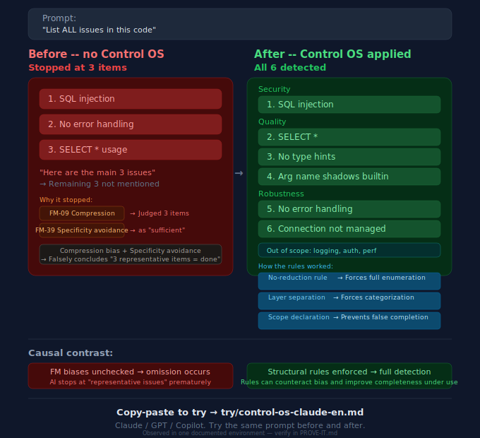

# SHI-Claude-Control-OS

**AIをスロットマシンではなく、システムとして動かす。**

[](LICENSE) [](https://ssrn.com/abstract=6299258)

[English version](README.md)

---

*昨日AIにコードレビューを頼んだ。今日も同じミスをする。ルールを説明し直す。「理解しました」と言って、1時間後に破る。*

**心当たりはありませんか？**

このリポジトリは、そんな瞬間のために存在します——AIは便利だけど、まだ脆くて、すぐ忘れて、あなたが全部覚えていないと回らない、と気づいた瞬間のために。

> **これは何か**: 構造的ガバナンス手法 + コピペ用テンプレート + 検証ガイド——AIの繰り返し失敗を減らすためのもの。
> **無料で得られるもの**: 40の失敗モード分類、3つのAIモデル用Control OSテンプレート、Before/Afterデモ、インタラクティブダッシュボード、検証プロトコル。
> **無料版だけで試行・検証・反証が完結します。** インストール不要——コピーして貼り付けてテストするだけ。
>
> **[→ 動いている形を見る: インタラクティブデモ（GitHub Pages）](https://naoyukioyama561-alt.github.io/SHI-Claude-Control-OS/demo/jp/index.html)** · [English](https://naoyukioyama561-alt.github.io/SHI-Claude-Control-OS/demo/en/index.html)

---

## 導入後に何が変わるか

| Before | After |
|--------|-------|
| 同じバグ、また発生。AIは謝る。明日また同じことをする | 失敗モードとして分類され、構造的にブロック |
| 月曜朝：新セッション。金曜の積み上げがゼロ | 継承システムが「痛み」をセッションを超えて保持 |
| 「ルールを理解しました」——同じ作業サイクル内で違反 | 外部モニターがリリース前に違反を検知 |
| プレッシャー下で品質が静かに劣化 | 4+1層品質システムが基準を維持 |
| しばらく離れて戻ると、文脈の継続性が失われている | 後継AIがルールだけでなく判断を継承 |

<p align="center">
  
</p>

→ [実例を見る](20-proof/public-case-01-ja.md)

---

## 今すぐ試す（30秒）

1. **コピー**: [Control OS](30-adoption/ja/try/control-os-claude.md)をAIのシステムプロンプトに貼り付ける
2. **テスト**: [Before/Afterデモ](30-adoption/ja/try/before-after-demo.md)で違いを確認（5分）
3. **検証**: [PROVE-IT-ja.md](PROVE-IT-ja.md)で主張を確認（15分）

| あなたのAI | Control OSテンプレート | テスト所要時間 |
|-----------|---------------------|-------------|
| Claude Code / Claude | [control-os-claude](30-adoption/ja/try/control-os-claude.md) | 30秒 |
| ChatGPT | [Control OS for GPT](30-adoption/ja/try/control-os-gpt.md) | 30秒 |
| GitHub Copilot | [Control OS for Copilot](30-adoption/ja/try/control-os-copilot.md) | 30秒 |

---

### 今すぐ確認できる実際の動き

**[公開安全なインタラクティブデモを開く（GitHub Pages）](https://naoyukioyama561-alt.github.io/SHI-Claude-Control-OS/demo/jp/index.html)**
- 日本語版デモ: [こちらをクリック](https://naoyukioyama561-alt.github.io/SHI-Claude-Control-OS/demo/jp/index.html)
- 英語版デモ: [こちらをクリック](https://naoyukioyama561-alt.github.io/SHI-Claude-Control-OS/demo/en/index.html)

*このデモはあなたの個人環境とは**完全に独立**した静的ページです。ボタン・検索・フィルタなど実際に操作できます。*

---

## なぜ存在するのか

ほとんどのAIプロジェクトは、モデルが弱いから失敗するのではない。
**制御層**が弱いから失敗する。

- 指示がバラバラのチャットに散在
- 修正が構造ではなく記憶に依存
- 一人だけが動かし方を知っている
- 小さなエラーが静かに運用負債になる

**このプロジェクトはそのパターンを断ち切る**——AIをもっと信じろと言うのではなく、制御点を定義し、行動を検証し、ワークフローを他の人間にも読めるようにする方法を提供する。

---

## リポジトリマップ

```
いまここ
  |
  |-- 「試したい」               --> 30-adoption/ja/try/     （30秒）
  |-- 「証拠を見たい」            --> PROVE-IT-ja.md          （15分）
  |-- 「なぜ効くのか知りたい」     --> 10-framework/ja/        （30分）
  |-- 「実績データが見たい」       --> 20-proof/ja/            （じっくり）
  |-- 「自分の環境で作りたい」     --> 30-adoption/ja/templates/ （あなたの環境で）
  |
  さらに深く:
  |-- 継承と哲学                 --> 40-heritage/ja/
  |-- スコープとエディション       --> 50-boundary/
  |-- 詳細なスコープ表            --> SCOPE-MATRIX-ja.md
```

<details>
<summary><strong>エビデンスラベルと用語</strong></summary>

`[観測値：単一環境]` = 単一環境で計測。`[設計目標]` = 設計上の目標、ベンチマークではない。`[例示値]` = 説明用、データではない。詳細は [GLOSSARY-ja.md](GLOSSARY-ja.md) を参照。

3層分離（役割分担）≠ 4+1品質システム（品質管理スタック）≠ 5層ループ（統治サイクル）。同じシステムの別次元。
</details>

---

## 研究的背景

本方法論は**構造的階層型知能（SHI）** 理論に基づいています。約1ヶ月のフルタイム観測 [観測値：単一環境・単一運用者] から132件の失敗モード [→ メトリクス](20-proof/metrics-ja.md) を分類し、ガバナンスアーキテクチャを研究論文として文書化しました。

> Oyama, N. (2025). *Structural Hierarchical Intelligence for AI Governance* (SSRNプレプリント、2025年投稿). SSRN: [https://ssrn.com/abstract=6299258](https://ssrn.com/abstract=6299258). リポジトリ公開: 2026年.

---

## クイックリンク

- [START-HERE](START-HERE-ja.md) — 3分でわかるオリエンテーション
- [PROVE-IT](PROVE-IT-ja.md) — すべての主張を自分で検証
- [インタラクティブ・ダッシュボード](docs/dashboard.html)（ファイルをダウンロードしてブラウザで開く、または[GitHub Pagesを有効化](https://docs.github.com/en/pages)）
- [SCOPE-MATRIX](SCOPE-MATRIX-ja.md) — 無料版と有料版の詳細な範囲分け
- [GLOSSARY-ja](GLOSSARY-ja.md) — 用語集
- [CONTRIBUTING-ja](CONTRIBUTING-ja.md) — 観測報告の出し方。あなたの観測がFM分類の改訂に直接つながります
- [CITATION](CITATION.cff) — 引用方法
- [CHANGELOG](CHANGELOG-ja.md) — 変更履歴

---

## 「自分もこれ欲しい」と思ったら

1. **⭐ このリポジトリにStarをつける** — 同じ痛みを持つ人に届きます
2. **[観測を報告する](https://github.com/naoyukioyama561-alt/SHI-Claude-Control-OS/issues/new?template=observation-report.md)** — あなたの観測が方法論を改善します
3. **一人に共有する** — 「AIは便利だけど、ワークフローはまだ信頼できない」と言っていた同僚に送ってください

> [なぜ作ったのか →](40-heritage/ja/why-i-am-doing-this.md)

---

<sub>

**ライセンス**: [MIT](LICENSE) — 自由に使用・改変・再配布できます。

**免責事項**: 本リポジトリに記載されたすべての効果は著者の環境で観察されたものです。AIモデル、利用コンテキスト、設定によって結果は異なる場合があります。結論を出す前に、すべての主張をご自身の環境で検証してください。本プロジェクトは方法論を提供するものであり、結果を保証するものではありません。

**Language**: [English version](README.md)

</sub>
