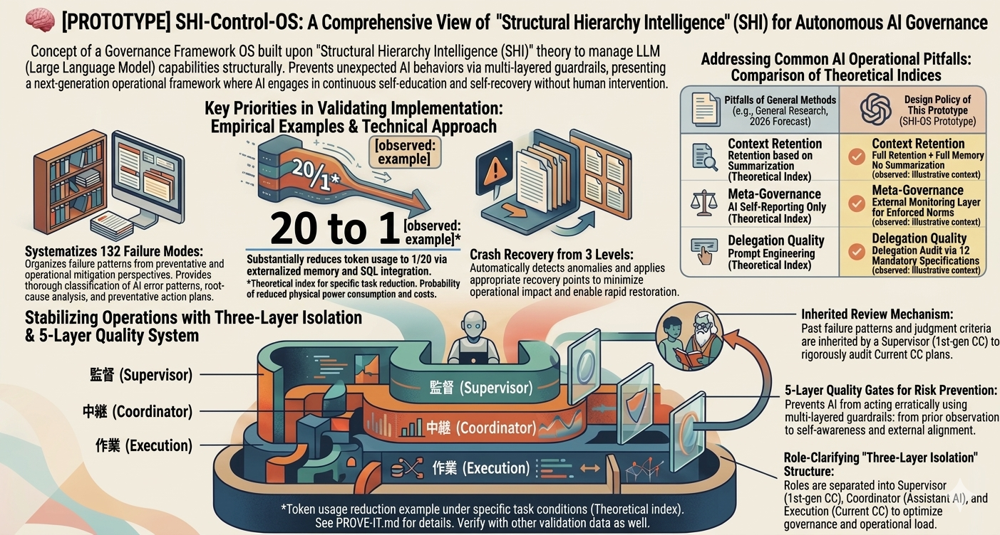

# SHI-Claude-Control-OS
Language: [日本語版はこちら / Japanese version](ja/README-ja.md)

**Make AI work like a system, not a slot machine.**

[](LICENSE) [](https://ssrn.com/abstract=6299258)

[日本語版 / Japanese](ja/README-ja.md)

---

*You asked your AI to review code yesterday. Today it makes the same mistake. You explain the rule again. It says "understood" — and breaks it an hour later.*

**Sound familiar?**

This repository exists for that moment — when you realize AI is useful but still too fragile, too forgetful, and too dependent on you remembering everything.

> **What this is**: A structural governance methodology + copy-paste templates + verification guide — for reducing repeated AI failures.
> **No installation required** — copy, paste, and test. Try it, challenge it, adapt it.
> **[→ See it live: Interactive Demo](https://naoyukioyama561-alt.github.io/SHI-Claude-Control-OS/demo/index.html)** · [日本語版](https://naoyukioyama561-alt.github.io/SHI-Claude-Control-OS/ja/demo/index-ja.html) · [Verify claims →](PROVE-IT.md)

---

## What changes after adoption

| Before | After |
|--------|-------|
| Same bug, again in active use. AI apologizes, repeats it tomorrow | Failure mode classified, structurally blocked |
| Monday morning: new session. AI forgot everything from Friday | Heritage system preserves context across sessions |
| "I understand the rules" — violates them in the same working cycle | External monitor catches violations before they ship |
| Quality degrades silently as context grows | 4+1 layer quality system maintains standards |
| You return after time away. Context continuity is gone | Successor AI inherits judgment, not just rules |

<p align="center">
  
</p>

→ [See a real case study](20-proof/public-case-01.md)

<p align="center">
  
</p>
<sub>Conceptual overview [illustrative] — verify with PROVE-IT.md. Observed values are single-environment.</sub>

---

## Try it right now (30 seconds)

1. **Copy** the [Control OS](30-adoption/try/control-os-claude.md) into your AI's system prompt
2. **Test** it with the [Before/After Demo](30-adoption/try/before-after-demo.md) (5 minutes)
3. **Verify** claims in [PROVE-IT.md](PROVE-IT.md) (15 minutes)

| Your AI | Control OS template | Time to test |
|---------|-------------------|--------------|
| Claude Code / Claude | [control-os-claude](30-adoption/try/control-os-claude.md) | 30 sec |
| ChatGPT | [Control OS for GPT](30-adoption/try/control-os-gpt.md) | 30 sec |
| GitHub Copilot | [Control OS for Copilot](30-adoption/try/control-os-copilot.md) | 30 sec |

Full Japanese versions: [ja/30-adoption/try/](ja/30-adoption/try/README-ja.md)

---

### See the system in action (public-safe static demo, 1 minute)

**[Open the interactive demo (GitHub Pages)](https://naoyukioyama561-alt.github.io/SHI-Claude-Control-OS/demo/index.html)** · [日本語版](https://naoyukioyama561-alt.github.io/SHI-Claude-Control-OS/ja/demo/index-ja.html) · [Offline version](docs/dashboard.html)

*Public-safe static pages — completely independent from any live environment. All displayed data is illustrative.*

---

## Why this exists

Many AI projects fail not because the model is weak, but because the **control layer** is weak, missing, or left implicit.
This repository focuses on that layer because it is the part most teams can inspect, redesign, and verify.

- Instructions live in scattered chats
- Fixes depend on memory instead of structure
- One person becomes the only person who knows how it works
- Small errors quietly become operational debt

**This project is one attempt to break that pattern** — not by asking you to trust AI harder, but by giving you a way to define control points, verify behavior, and make the workflow legible to other humans.

---

## Repository map

```
YOU ARE HERE
  |
  |-- "I want to try it"          --> 30-adoption/try/        (30 seconds)
  |-- "I want to see the proof"   --> PROVE-IT.md             (15 minutes)
  |-- "I want to understand why"  --> 10-framework/           (30 minutes)
  |-- "I want the evidence"       --> 20-proof/               (deep dive)
  |-- "I want to build my own"    --> 30-adoption/templates/  (your environment)
  |
  Deeper:
  |-- Heritage & philosophy       --> 40-heritage/
  |-- Scope breakdown             --> SCOPE-MATRIX.md
```

<details>
<summary><strong>Evidence labels & terminology</strong></summary>

`[observed: single environment]` = measured in one environment. `[design target]` = architecture goal, not benchmarked. `[illustrative]` = explanatory, not data. See [GLOSSARY.md](GLOSSARY.md) for full definitions.

Three-layer separation (role split) ≠ 4+1 quality system (quality stack) ≠ 5-layer loop (governance cycle). They describe different dimensions of the same system.
</details>

---

## If you want to test or improve this in your environment

You do not need to write code to contribute. The most valuable contribution is a real observation from your own AI environment.

Testing this repository requires no sign-in. A GitHub account is only needed if you want to open an Issue or PR.

1. **Try it first** — start with [30-adoption/try/](30-adoption/try/README.md)
2. **[Report an observation](https://github.com/naoyukioyama561-alt/SHI-Claude-Control-OS/issues/new?template=observation-report.md)** — share what happened in your environment
3. **[Challenge a claim](https://github.com/naoyukioyama561-alt/SHI-Claude-Control-OS/issues/new?template=claim-challenge.md)** — if something feels overstated, dispute it directly
4. **Suggest one structural improvement** — open an Issue if the evaluation flow felt unclear or hard to follow
5. **Star or share if it was useful** — help other builders find a methodology they can evaluate for themselves

---

<sub>

**License**: [MIT](LICENSE) — use, modify, and redistribute freely.

**Disclaimer**: All effects described in this repository were observed in the author's environment. Results may vary depending on AI model, usage context, and configuration. Verify all claims in your own environment before drawing conclusions. This project provides a methodology, not guaranteed outcomes.

**Language**: [日本語版はこちら / Japanese version](ja/README-ja.md) · **Background**: [Why I built this](40-heritage/why-i-am-doing-this.md) · **Research**: [SSRN preprint](https://ssrn.com/abstract=6299258)

</sub>
