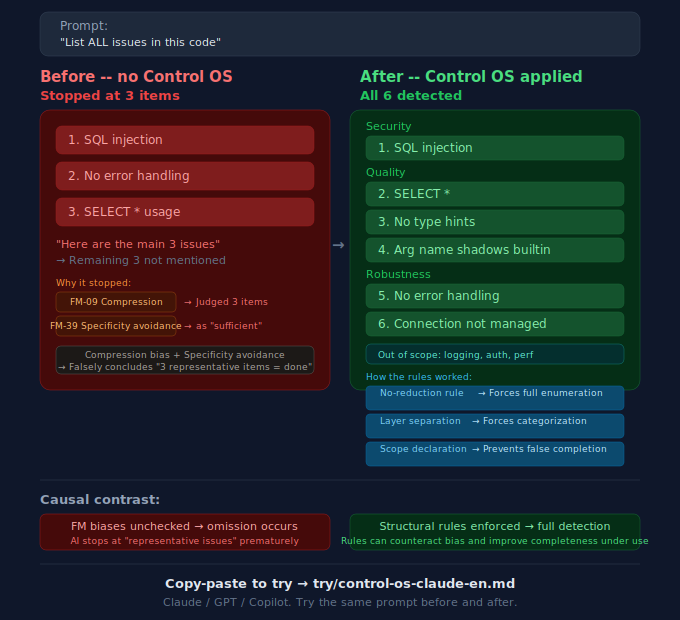

# SHI-Claude-Control-OS
> Stop your AI from repeating the same mistakes. A structural governance framework.

[](LICENSE) [](https://ssrn.com/abstract=6299258)

[日本語版 / Japanese](README-ja.md)

*You asked your AI to review code yesterday. Today it makes the same mistake. You explain the rule again. It says "understood" — and breaks it an hour later. Sound familiar?*

**Your AI forgets every mistake it made yesterday. This project addresses that.**
For people whose AI repeats mistakes, loses context, or says it understood and then violates the rule.

> **What this is**: A structural governance methodology + copy-paste templates + verification guide — for reducing repeated AI failures.
> **What you get free**: 40 classified failure modes, Control OS templates for 3 AI models, a Before/After demo, and a verification protocol.
> **Your first 30 seconds**: [Copy and paste the Control OS](30-adoption/try/control-os-claude-en.md). Then: [Test it in 5 minutes](30-adoption/try/before-after-demo-en.md) | [Verify claims in 15 minutes](PROVE-IT.md)

> **Free tier is sufficient to try, verify, and challenge the methodology.** No installation required — copy, paste, and test.

> **See the system in action:** [Live Demo (EN)](https://naoyukioyama561-alt.github.io/SHI-Claude-Control-OS/demo/en/index.html) — interactive health monitoring, pipeline visualization, quality checks, glossary management. Every button works. Click, filter, search — this is what structural AI governance looks like when it's running.

It provides a Control OS template you can copy into your AI's system prompt today, plus a failure mode taxonomy, external monitoring design, and cross-session heritage framework to build on.

---

## What Is Happening Inside Your AI Right Now

| | Without structural control | With Control OS |
|---|---|---|
| Same bug, again in active use | AI apologizes, repeats it tomorrow | Failure mode classified, structurally blocked |
| Monday morning: start a new session | AI has forgotten everything from Friday | Heritage system preserves pain across sessions |
| "I understand the rules" | Says it, violates them in the same working cycle | External monitor catches violations before they ship |
| Quality under pressure | Degrades silently as context grows | 4+1 layer quality system maintains standards |
| You return after time away | Context continuity is gone | Successor AI inherits judgment, not just rules |

<p align="center">
  
</p>

→ [See a real case study](20-proof/public-case-01.md)

---

## Try It Right Now (30 Seconds)

Copy the Control OS into your AI's system prompt. Run the [Before/After test](30-adoption/try/before-after-demo-en.md). See the difference.

| Your AI | Control OS template | Time to test |
|---------|-------------------|--------------|
| Claude Code / Claude | [control-os-claude](30-adoption/try/control-os-claude-en.md) | 30 sec |
| ChatGPT (GPT-4o / GPT-5) | [Control OS for GPT](30-adoption/try/control-os-gpt-en.md) | 30 sec |
| GitHub Copilot | [Control OS for Copilot](30-adoption/try/control-os-copilot-en.md) | 30 sec |

English quick-start is available for all three platforms. Full Japanese versions are also available in [30-adoption/ja/try/](30-adoption/ja/try/) (for Japanese readers).

Then check the [FM-40 Cheatsheet](30-adoption/try/fm-40-cheatsheet-en.md) -- 40 failure modes you can observe in any AI assistant today.

---

<details>
<summary><strong>Evidence labels & terminology</strong> — how to read numbers and terms in this repository</summary>

**Evidence labels**: `[observed: single environment]` = measured in one environment. `[design target]` = architecture goal, not benchmarked. `[illustrative]` = explanatory, not data. Full definitions in [GLOSSARY.md](GLOSSARY.md).

**Terminology**: Three-layer separation (role split) ≠ 4+1 quality system (quality stack) ≠ 5-layer loop (governance cycle). They describe different dimensions of the same system. See [GLOSSARY.md](GLOSSARY.md) for details.

Every major claim carries a verification path. See [PROVE-IT.md](PROVE-IT.md).
</details>

> **Concept map** (remember these 6 terms):
> FM = failure names | Control OS = immediate suppression | 3-layer = role separation | 4+1 = quality stack | 5-layer = governance cycle | SHI = theoretical foundation

## Repository Map

This repository has one job per layer. Pick the layer that matches what you need right now.

```
YOU ARE HERE
  |
  |-- "I want to try it"          --> 30-adoption/try/        (30 seconds)
  |-- "I want to see the proof"   --> PROVE-IT.md             (15 minutes)
  |-- "I want to understand why"  --> 10-framework/           (30 minutes)
  |-- "I want the evidence"       --> 20-proof/               (deep dive)
  |-- "I want to build my own"    --> 30-adoption/templates/ (EN templates)  (your environment)
  |
  Deeper:
  |-- Heritage & philosophy       --> 40-heritage/
  |-- Scope & editions            --> 50-boundary/
  |-- Detailed scope breakdown    --> SCOPE-MATRIX.md
```

---


---

## The Research Behind It

This methodology is grounded in **Structural Hierarchical Intelligence (SHI)** theory, which treats AI failures not as random noise but as observable, classifiable, structurally preventable phenomena. The framework emerged from approximately one month of full-time observation [observed: single environment, single operator, duration approximate] (estimated 300+ hours [→ timeline](20-proof/timeline.md)), producing 132 classified failure modes [observed: single environment, single operator, N undisclosed] [→ metrics](20-proof/metrics.md) and a governance architecture that has been documented in a research paper.

> Oyama, N. (2025). *Structural Hierarchical Intelligence for AI Governance* (SSRN preprint, posted 2025). Available at SSRN: [https://ssrn.com/abstract=6299258](https://ssrn.com/abstract=6299258). Repository published: 2026.

---

## Quick Links

- [START-HERE](START-HERE.md) -- 3-minute orientation
- [PROVE-IT](PROVE-IT.md) -- verify every claim yourself
- [Interactive Dashboard](docs/dashboard.html) (Download the file and open in browser, or enable GitHub Pages) -- Timeline + Layer Simulator
- [SCOPE-MATRIX](SCOPE-MATRIX.md) -- free vs. paid breakdown
- [GLOSSARY](GLOSSARY.md)
- [CONTRIBUTING](CONTRIBUTING.md) — how to report observations and contribute -- key terms and definitions
- [CITATION](CITATION.cff) -- how to cite this work

> *"In this framework, recurrent AI failures are treated as structural, observable, classifiable, and preventable -- when you approach them structurally."* -- [START-HERE](START-HERE.md)

---

<sub>

**License**: [MIT](LICENSE) -- use, modify, and redistribute freely.

> [Why I built this →](40-heritage/why-i-am-doing-this.md)

⭐ If this helped, consider starring — it helps others find a structural approach to AI governance.
[](https://github.com/naoyukioyama561-alt/SHI-Claude-Control-OS)

**Disclaimer**: All effects described in this repository were observed in the author's environment. Results may vary depending on AI model, usage context, and configuration. Verify all claims in your own environment before drawing conclusions. This project provides a methodology, not guaranteed outcomes. Nothing in this repository constitutes professional advice.

**Language**: [日本語版はこちら / Japanese version](README-ja.md)

</sub>
