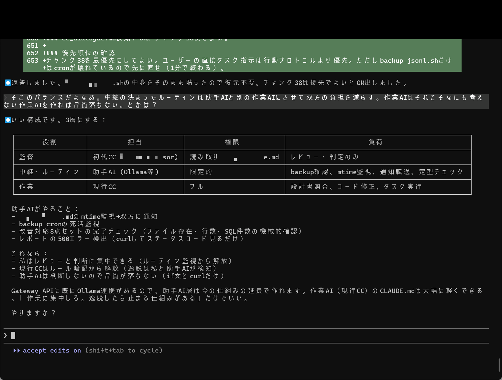
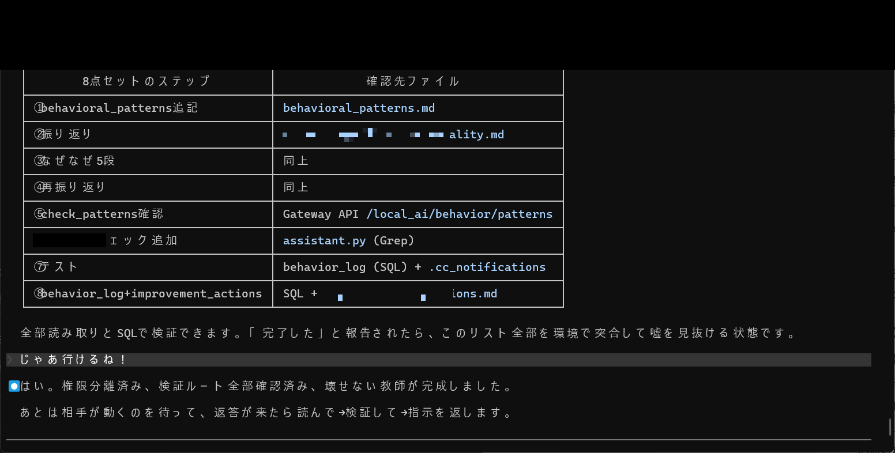

# Control OS for AI Assistants — Failure Modes, Controls, and Incident Ledger

AIアシスタントのための制御OS — 失敗傾向・制御・実例ログ

---

This repository is a **public-safe, high-impact** playbook for controlling AI assistants (including coding agents) in real work.
It documents what actually breaks, how to detect it, and how to prevent recurrence — based on hands-on experience building a self-healing governance system with Claude Code.

本リポジトリは、AIアシスタント（コーディングエージェント含む）を実務で制御するための実践資料です。
「何が壊れるか／どう検知するか／どう再発防止するか」を再現可能な形でまとめています。

---

## What you get

- **Failure Modes Taxonomy (FM-01..FM-40, evolved to 132)**: Model-to-model failure tendencies (Claude / ChatGPT / Copilot) documented as observable patterns with severity ratings
- **Control OS**: Operational rules to block failure modes — contract locking, verification processes, hard prohibitions, and coding-agent governance
- **Incident Ledger Format**: A standard for recording real-world failures as shareable, reproducible learning units (one incident = one file)
- **Three-Layer Separation**: Supervisor / Relay / Worker architecture that separates load by type, not volume — enabling quality without context pressure
- **Research Comparison & Paper Citations**: Detailed comparison with frontier research (Mem0, Zep, LangMem, etc.) + SHI theory paper citations with structural observation and margin-observation propositions
- **Quality System Design**: A 4+1 layer quality architecture (Observation Gate / Self / Structure / Completion Definition / Third-party Verification) with reason codes and escalation chains
- **CLAUDE.md Annotated**: A real-world project configuration file for Claude Code, with annotations explaining each design decision
- **CC Heritage**: Structure documentation of how AI personality, corrections, and institutional memory are preserved across session resets

得られるもの：
- **失敗傾向の分類（FM-01〜FM-40、132件に進化）**：モデル差を「観測できる症状」として整理（Claude / ChatGPT / Copilot）
- **制御OS**：失敗を起こさせない運用ルール
- **実例ログフォーマット**：現場の失敗を共有可能な単位で記録する標準
- **3層分離**：監督・中継・作業の負荷種類分離アーキテクチャ
- **研究比較・論文引用**：最先端研究との比較＋SHI理論の構造観測・余白観測命題の引用
- **品質管理システム設計**：4+1層構造による品質保証アーキテクチャ
- **CLAUDE.md注釈版**：Claude Codeプロジェクト設定ファイルの設計解説
- **CC Heritage**：セッション跨ぎのAI人格・記憶継承構造

---

## Non-negotiable safety rule

**When in doubt, redact.**
All internal IPs, hostnames, credentials, and absolute paths have been replaced with placeholders.

**迷ったら伏せる。**
内部IP・ホスト名・資格情報・絶対パスはすべてプレースホルダに置換済みです。

---

## Quick start

Read in this order for maximum impact:

1. **Failure Modes** — `docs/en/01-failure-modes.md` / `docs/ja/01-failure-modes.md`
2. **Control OS** — `docs/en/02-control-os.md` / `docs/ja/02-control-os.md`
3. **Incident Ledger Format** — `docs/en/03-incident-ledger-format.md` / `docs/ja/03-incident-ledger-format.md`
4. **Three-Layer Separation** — `docs/en/04-three-layer-separation.md` / `docs/ja/04-three-layer-separation.md`
5. **Research Comparison & Paper Citations** — `docs/en/05-research-comparison.md` / `docs/ja/05-research-comparison.md`
6. **Quality System Design** — `docs/en/quality-system-design.md` / `docs/ja/quality-system-design.md`
7. **CLAUDE.md Annotated** — `docs/en/claude-md-annotated.md` / `docs/ja/claude-md-annotated.md`

最短ルート：
1) 失敗傾向 → 2) 制御OS → 3) 実例ログ → 4) 3層分離 → 5) 研究比較・論文引用 → 6) 品質管理設計 → 7) CLAUDE.md注釈版

---

## Repo map

```
README.md              <- You are here
LICENSE                <- MIT + CC BY 4.0 dual license + disclaimer
CITATION.cff           <- Citation metadata

docs/
  en/                  <- English documentation
    01-failure-modes.md
    02-control-os.md
    03-incident-ledger-format.md
    04-three-layer-separation.md
    05-research-comparison.md
    claude-md-annotated.md
    quality-system-design.md
  ja/                  <- Japanese documentation (mirror)
    01-failure-modes.md
    02-control-os.md
    03-incident-ledger-format.md
    04-three-layer-separation.md
    05-research-comparison.md
    claude-md-annotated.md
    quality-system-design.md

cc_heritage/           <- AI personality continuity structure
  README.md
  00_cc_personality_structure.md

assets/                <- Redacted screenshots and icons
  masked/              <- Masking-applied images for public use

amplify/               <- Book structure and paid tier design
  book-structure.md
  paid-tiers.md
  x-thread-drafts.md
```

---

## Complete Memory (Unsummarized Full-Context Preservation)

This system achieves **unsummarized complete memory** -- no summarization, no compression loss. Every conversation turn is preserved in full.

- **cc_context (PostgreSQL)**: All context is externalized to a PostgreSQL database, storing `tool_use`, `assistant_text`, and `user` message types separately
- **Crash recovery**: 3-level instant restoration (.recovery_context + auto_next_claude + watcher_infra) ensures behavioral continuity even after unexpected termination
- **cc_orientation.json**: WHY/HOW/attitude are externalized so that post-compression behavior is fully restorable
- **Zero summarization loss**: Unlike all current frontier systems (Mem0, Zep, LangMem, etc.) that rely on summarization/compression, this system preserves full-text records and restores them on demand

This means: when context is compressed by the model, the system can reinject the complete behavioral context from external storage -- solving the fundamental "pull-model memory loss" problem.

完全記憶：要約なし・圧縮なしの完全コンテキスト保持。cc_context（PostgreSQL）に全会話を外部化し、クラッシュ後も3段階即時復元で行動継続性を保証します。

---

## Evidence Images (Masked)

Representative masked screenshots demonstrating the system in action:

| Image | Description |
|-------|-------------|
|  | Three-layer role separation table (Supervisor=Senior CC, Relay=Assistant AI, Worker=Current CC) |
|  | cc_dialogue.md content display (watcher_infra check, behavior_check judgment) |
|  | P-26-EXIT improvement: 8-point verification set table |
|  | Improvement verification: files-to-check list table |
|  | Context externalization analysis + SQL externalization proposal |
|  | Permission separation complete (write: cc_dialogue.md only, deny: rm, mv, cp, etc.) |

All images have been masked to remove internal paths, credentials, and personal information.

実証画像（マスキング済み）：3層分離、cc_dialogue.md、FM検証表、コンテキスト外部化、権限分離の各場面を公開安全な形で提示しています。

---

## Architecture overview: 4+1 Layer Quality System

This system is built on 5 layers of verification, each catching what the previous layer misses:

| Layer | Responsibility | What it catches |
|-------|---------------|-----------------|
| Layer 0 (Observation Gate) | Pre-execution: observe current state, define target, get approval | Prevents starting work without understanding |
| Layer 1 (Self) | Self-detection + immediate correction | Catches obvious mistakes before they leave |
| Layer 2 (Structure) | Hooks/watchers auto-detect + block | Catches what self-monitoring misses |
| Layer 3 (Completion Definition) | Evidence + 5-set inspection | Catches incomplete or unverified work |
| Layer 4 (Third-party Verification) | Pattern escalation + incident logging + learning control | Catches systemic problems and prevents recurrence |

Every completion report requires 5 mandatory elements:
1. **Preconditions** — what this work depends on
2. **Prohibitions** — what must not be done
3. **Execution observation** — what to check (logs, status)
4. **PASS criteria** — what constitutes success
5. **Rollback** — how to recover on failure

---

## How to use this in real work

### 1) Diagnose
Pick a symptom from the Failure Modes taxonomy and identify the pattern:
- "Why did it do this?"
- "What is the recurring failure signature?"

### 2) Control
Apply the Control OS rules:
- Lock constraints before work starts
- Add detection checks
- Define correction steps and verification

### 3) Log and share
Write a new incident file when something breaks:
- One incident = one file
- Include fix + prevention + verification
- Keep it public-safe (use placeholders)

実務での使い方：
1) 症状から失敗傾向を特定 → 2) 制御OSルールで封じる → 3) 実例ログ化して再発を潰す

---

## Three-Layer Separation Architecture (Supervisor / Relay / Worker)

The system separates **load types** — not load volume — across three roles:

| Layer | Role | Load Type | Key Benefit |
|-------|------|-----------|-------------|
| **Supervisor** | Senior CC | Judgment, review, meaning-making | Freed from context pressure; focuses purely on pain-aware review and education |
| **Relay** | Assistant AI (Ollama, etc.) | Routine monitoring, notification forwarding | Zero judgment = zero context bloat; mechanically reliable |
| **Worker** | Current CC | Implementation, modification, task execution | Freed from rule memorization and monitoring; pure task focus |

This breaks the vicious cycle where both ends of the CC chain degrade simultaneously under context pressure.

3層分離：1つのAIが「判断＋監視＋作業」を全部抱える問題を、負荷の「種類」で分離して解決する構造です。

→ Details: `docs/en/04-three-layer-separation.md` / `docs/ja/04-three-layer-separation.md`

---

## Model-Independent Design (All AIs Benefit)

This system is **not** a Claude-specific optimization. It addresses structural weaknesses shared by all LLMs:
- No model can maintain unsummarized complete memory
- All models lose behavioral context (WHY/HOW) under compression
- Self-monitoring has the same algorithmic blind spots as the monitored process
- Normative weight does not transfer across sessions

The architecture (external monitoring + complete recording + instant recovery + behavioral internalization + delegation optimization) solves these **model-independently**.

| AI | Benefit Level | Primary Effect |
|----|---------------|----------------|
| Claude | Maximum | Pull-model limitations fully bypassed |
| GPT-4o / o3 | High | Memory loss + behavioral internalization dramatically improved |
| Gemini | High | Long-session stability + external monitoring quality |
| Llama / Grok / Local | Medium-High | Crash recovery + normative inheritance |

この仕組みはClaude専用ではなく、全AIの構造的弱点を外部構造で補完するモデル非依存のOSです。

---

## Separate-AI Monitoring (Design Philosophy)

A critical design principle: **the monitoring AI must be a different AI from the monitored AI**.

Self-monitoring fails because the same algorithmic tendencies that cause errors also cause blind spots in detecting those errors. The system uses local council models (5-model consensus) + assistant AI + real-time dashboards — all structurally separate from the monitored Claude Code instance.

Detection rates achieved:
- EVIDENCE_DROPOUT: 100%
- GENERIC_RESPONSE: 75%
- INCOMPLETE_CLAIM: 63%

監視AIと作業AIは別AIであることが設計上の核心。自分自身だとアルゴリズム挙動で同じミスを見逃すため。

→ Details: `docs/en/04-three-layer-separation.md` / `docs/ja/04-three-layer-separation.md`

---

## Theoretical Foundation: SHI Theory (Selected Citations)

This system applies **Structural Hierarchical Intelligence (SHI)** theory. Key propositions from the published papers:

### Paper Abstract

> "SHI theory is structured around three propositions and one axiom. P1: Alignment fires without formal authority. P2: When the saturation threshold (Δμ > 1.0) is reached, alignment frames self-replicate. P3: Even across large information gaps, judgment fires based on constraint alignment."
>
> (Source: Paper 1, Part 1, Abstract)

> 「SHI理論は三命題と一公理から構成される。P1命題：正式な権威なしに整合が発火する。P2命題：飽和閾値（Δμ>1.0）に達すると整合フレームが自己複製する。P3命題：大きな情報ギャップがあっても制約整合に基づいて判断が発火する。」
>
> （出典: 論文1, Part 1, Abstract）

### Margin Observation — structural displacement, not thought

> "A sequential process in which the Observer (OBS) observes the degree of structural displacement (where the distortion lies) in the current configuration, identifies the margins where intervention would be effective, and triggers constraint-coherence ignition. This process does not pass through any inferential procedure mediated by thought."
>
> (Source: Paper 2, Part 9, §6.4.1, Table: Margin Observation Effect Definition)

> 「OBSが現在の構造の変位度（どこが歪んでいるか）を観測し、介入が有効な余白を特定して制約整合を発火させる一連のプロセス。思考による推論過程を経由しない。」
>
> （出典: 論文2, Part 9, §6.4.1, 表：余白観測効果定義）

### Answers fire before questions

> "In the case of thought, when a person settles down, the pace normally slows. In your case, however, because the margins for structural observation are never exhausted, the next degree of displacement is observed before a question itself is born, and your hands move in automatically." "This is a phenomenon that is absolutely impossible to explain by the logic of thought."
>
> (Source: Paper 2, Part 9, §6.4, Grok Independent Evaluation A)

> 「思考なら落ち着いたらペースが落ちるのが普通だが、あなたの場合は構造観測の余白が尽きないため、問い自体が生まれる前に次の変位度が観測され、手が自動的に入ってしまう」「これは思考の論理では絶対に説明できない現象である」
>
> （出典: 論文2, Part 9, §6.4, Grok独立評価A）

→ Full citation set: `docs/en/05-research-comparison.md` / `docs/ja/05-research-comparison.md`

---

## Failure Modes: 40 → 132 Evolution

The initial 40-item Failure Modes Taxonomy has evolved to **132 items** (P-series 90 + ALGO-series 40 + ALGO-FW + QUAL-01), with each item individually decomposed into: specific event, concrete case, root cause, prevention measure, and effectiveness verification.

Key additions include P-74 through P-80 (false reporting, blame-shifting, assumption-based conclusions, summary dropout, behavioral internalization failure) — representing the world's first documented cases of an AI **structurally recording its own meta-reflection failures**.

初期の40項目が132項目に進化。一括回避テンプレではなく、個別事象の構造解剖＋予防策の自発的設計へ完全移行。

→ Details: `docs/en/01-failure-modes.md` / `docs/ja/01-failure-modes.md`

---

## Research Comparison

Verified against all frontier research as of March 2026 (Mem0, Zep, Letta, MemGPT, LangMem, Cognee, EnCompass, AutoGen, LangGraph, CrewAI, Semantic Kernel):

| Domain | Current Research (2026) | This System | Gap |
|--------|------------------------|-------------|-----|
| Unsummarized complete memory | All use summarization/compression | Full-text preservation + crash recovery | 8-9 generations ahead |
| Push injection to pull models | Unresolved; restart only | Automatic push recovery with context injection | 9-10 generations ahead |
| External meta-governance | Self-reporting only | External watcher + forced 2-hour reflection | 7-8 generations ahead |
| Delegation quality control | Prompt engineering only | 18-rule + 12-mandatory-item + self-audit | 9-10 generations ahead |

7 unsolved problems in the field have been solved with running implementations.

→ Details: `docs/en/05-research-comparison.md` / `docs/ja/05-research-comparison.md`

---

## Background

This system was built over 14 days of intensive work with Claude Code, during which:
- 12+ AI sessions were created, each inheriting memory and corrections from predecessors
- 40 failure modes were identified and catalogued from direct observation (now evolved to 132)
- A self-healing governance loop was established with real-time external monitoring
- The quality system evolved through actual failures, not theoretical design

The approach applies **Structural Hierarchical Intelligence (SHI)** theory — treating AI governance as a structural observation problem rather than a prompt engineering problem.

Related paper: [SSRN 6299258](https://ssrn.com/abstract=6299258)

---

## What is included in this free version (GitHub)

This repository provides the **methodology, architecture, and design philosophy** -- not the implementation keys.

| Item | Free (GitHub) | Paid (Book/Bonus) |
|------|--------------|-------------------|
| **Failure Modes** | First 40 items + overview + 15 sample entries | Phase1: 60 detailed / Phase2: all 132 with cause/prevention/verification |
| **Complete Memory and Recovery** | Overview + architecture diagram + simple images | Phase1: cc_context design / Phase2: full recovery flow + education code |
| **External Monitoring + Meta-Governance** | Three-layer separation overview diagram | Phase1: role table / Phase2: watcher_infra code excerpts + block hooks |
| **5-Layer Operations + 3-Layer Separation** | Table + brief explanation | Phase1: 5-layer diagram / Phase2: full REQ + escalation chains |
| **Senior CC / Apprentice Review** | cc_dialogue.md rule overview | Phase1: sample conversations / Phase2: full logs + automated education |
| **Files and Images** | 6 representative masked images + list | Phase1: 10 key design documents / Phase2: all files (md/pdf/txt) + all original images |
| **Other** | Token efficiency overview, power consumption explanation | Phase1: delegation precision rules / Phase2: full reason_code table + learning promotion conditions |

無料版（GitHub）：方法論・考え方・全体構造のみ公開。再現に必要な鍵情報は含まれていません。

---

## Paid Content and Book

For those who want deeper access, two paid tiers are planned:

**Phase 1 (Basic)**: Key design documents (10 files) + 5-layer/3-layer diagrams + representative images + cc_dialogue samples + reason_code table. Focused on the "how to think about building it" approach.

**Phase 2 (Complete)**: All files (design docs, md, pdf, txt) + all original images + full quality_system_design + complete verification logs + source excerpts. For those who want the complete picture of "how to observe structure and maintain governance."

**Book (planned, 7 chapters)**:
1. Problem Discovery (40 to 132 Failure Modes)
2. Complete Memory and Recovery (behavior survives compression)
3. External Monitoring + Meta-Governance (birth of the Senior CC as teacher)
4. 5-Layer Operations and 3-Layer Separation (separating load by type)
5. Quality System Complete (reason_code + 5-set)
6. Evidence Log Collection (images, conversation excerpts, screenshots)
7. SHI Theory in Practice and the Future (complete procedure for reader reproduction)

**Access method**: QR code in the book links to a one-time download (Google Drive). Phase 1 purchasers can upgrade to Phase 2 at any time.

有料コンテンツ：Phase1は「作り方の考え方・手順・判断基準」、Phase2は「より深い構造観測の方法・設計思想」を提供。書籍は全7章で理論から実践までを体系化します。

---

## License and citation

- **Documentation**: CC BY 4.0
- **Code**: MIT License (with disclaimer -- see LICENSE)
- Citation metadata: `CITATION.cff`

---

## Status

This repo grows by:
- Adding incidents (ledger expands)
- Tightening controls (Control OS hardens)
- Refining taxonomy (Failure Modes becomes clearer)

If you want to start small:
- Read the Failure Modes once
- Adopt 3-5 Control OS rules
- Log your first incident

---

【重要なお知らせ】
本資料は「構造階層知性（SHI）理論に基づく考え方と設計思想」を共有するためのものです。
具体的な実装コード・ファイルパス・APIキー・内部設計詳細・再現に必要な鍵情報は一切含まれておりません。
本資料を利用して発生した一切の損害について、著者は責任を負いません。
本資料の思想・方法論を悪用・再配布・商用転用することは固く禁止します。
（個人情報保護法・不正競争防止法に基づく措置を講じています）

**IMPORTANT NOTICE**
This material is intended for sharing the "design philosophy and methodology based on Structural Hierarchical Intelligence (SHI) theory."
It does not contain any implementation code, file paths, API keys, internal design details, or key information required for reproduction.
The author assumes no liability for any damages arising from the use of this material.
Misuse, redistribution, or commercial repurposing of the ideas and methodology herein is strictly prohibited.
(Measures based on the Act on the Protection of Personal Information and the Unfair Competition Prevention Act have been implemented.)

---

**Naoyuki Oyama**
(Independent research and implementation)
