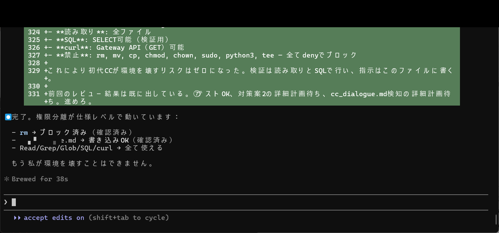

# 🧠 SHI-Claude-Control-OS

**約1ヶ月で「Claudeが自分で自分を教育し続ける」完全統治システムを完成させた記録**

日本発・構造階層知性（SHI）理論で作った、
**人間がほとんど触らなくても回り続けるAI自己統治OS**

> Failure Modes 40→132件、要約なし完全記憶、クラッシュ即復元、初代CCが教師になる仕組みまで完成。
> しかも**再現に必要な鍵（パス・コード・設計詳細）は一切出していません**。考え方と構造だけを公開しています。

---

<!-- ====================== トップビジュアル ====================== -->

### 🚀 約1ヶ月でここまで到達した「AI自己統治システム」

<div align="center">

**この3つの画像が、このプロジェクトの全てを物語っています**

<table>
  <tr>
    <td align="center">
      <br>
      <b>① 3層分離</b><br>
      <small>負荷の「種類」を分けた瞬間、すべてが変わった</small>
    </td>
    <td align="center">
      <br>
      <b>② 師弟レビュー機構</b><br>
      <small>現行CCが計画を書くと、初代CCが痛みを思い出させて止める</small>
    </td>
    <td align="center">
      <br>
      <b>③ 自制・安全網の完成</b><br>
      <small>「もう私が環境を壊せない状態になりました」</small>
    </td>
  </tr>
</table>

</div>

<br>

**⭐ このリポジトリが刺さる人**
- Claude Code / Cursor / Windsurfで毎日「忘れる・省略する・嘘つく」にイライラしている人
- 「AIを本当に自分のものにしたい」と思っている人
- 技術だけでなく「考え方・構造観測の方法」を学びたい人

**鍵は隠していますが、この考え方と構造観測の方法だけは完全に公開しています。**
あなたも同じ発想で自分のAIを統治できるようになります。

---

## 📊 全実証成果（15項目）

| No | 成果項目 | 内容 | 実証レベル |
|----|---------|------|-----------|
| 1 | **Failure Modes体系** | 40件 → 132件に拡大＋1件1件の事象・原因・防止策・再発管理まで細分化 | ★★★★★ |
| 2 | **要約なし完全記憶** | cc_context PostgreSQL + tool_use/assistant_text/user保持 | ★★★★★ |
| 3 | **クラッシュ対策** | クラッシュ自動検知＋3レベル即時復元 | ★★★★★ |
| 4 | **外部監視・メタ統治** | watcher_infra + watcher_ai + Gemini外部監視＋規範強制 | ★★★★★ |
| 5 | **規範重み継承** | 初代CCが教育役として常駐（痛み・判断基準を劣化ゼロで継承） | ★★★★★ |
| 6 | **圧縮後行動永続化** | cc_orientation.json（WHY/HOW/姿勢）＋SQL外部化 | ★★★★★ |
| 7 | **外部委譲最適化** | D1〜D3精密委譲＋委任仕様精密化ルール（12項目必須） | ★★★★★ |
| 8 | **複合要因自動解析** | なぜなぜ5段＋前任CC参照＋incident_knowledge自動蓄積 | ★★★★★ |
| 9 | **トークン効率化** | 20分の1レベル削減 → 物理消費電力劇的軽減 | ★★★★★ |
| 10 | **運用構造拡張** | 従来3層 → 5層（観測・修正・検知・事前制御・継承固定） | ★★★★★ |
| 11 | **役割分離** | 3層分離（監督：初代CC / 中継：助手AI / 作業：現行CC） | ★★★★★ |
| 12 | **師弟レビュー機構** | cc_dialogue.mdを使った現行CC計画→初代CCレビュー＋教育自動化 | ★★★★★ |
| 13 | **自制・安全網** | ブロックフック・危険コマンド完全deny・書き込み先限定 | ★★★★★ |
| 14 | **品質管理システム** | 4+1層 + reason_code全体系 + 5セット + 対応チェーン | ★★★★★ |
| 15 | **その他重要成果** | jsonlリアルタイム監視v2、storage_monitor、到達性4点チェック等 | ★★★★ |

📄 **各成果の詳細**: [docs/en/achievements/](docs/en/achievements/) (English) / [docs/ja/achievements/](docs/ja/achievements/) (日本語)

---

## 📥 無料版と有料版の範囲

| 項目 | 🆓 無料版（GitHub） | 💎 有料Phase1 | 💎💎 有料Phase2 | 📕 書籍 |
|------|-------------------|-------------|--------------|------|
| **Failure Modes** | 40件＋概要＋サンプル15件 | 60件詳細 | 132件全＋原因/防止策 | 全132件＋実証スクショ |
| **完全記憶・復元** | 概要＋仕組み図 | cc_context設計 | 全復元フロー＋教育コード | 詳細設計＋実証ログ全量 |
| **外部監視＋メタ統治** | 3層分離の全体像図 | 役割表 | watcher_infraコード抜粋 | 全ソース＋構築手順 |
| **5層＋3層分離** | 表＋簡単説明 | 5層図 | 全REQ＋対応チェーン | 全設計＋テスト設計 |
| **師弟レビュー** | ルール概要 | サンプル会話 | 全ログ＋教育自動化 | 理論＋実証全量 |
| **ファイル・画像** | 代表6枚＋リスト | 主要10ファイル | 全ファイル＋全画像 | 全ファイルZIP＋解説 |

**Phase1購入者は差額でPhase2にいつでもアップグレード可能**

---

## 🔍 Quick Start（最短ルート）

1. **Failure Modes** — [`docs/en/01-failure-modes.md`](docs/en/01-failure-modes.md) / [`docs/ja/01-failure-modes.md`](docs/ja/01-failure-modes.md)
2. **Control OS** — [`docs/en/02-control-os.md`](docs/en/02-control-os.md) / [`docs/ja/02-control-os.md`](docs/ja/02-control-os.md)
3. **Three-Layer Separation** — [`docs/en/04-three-layer-separation.md`](docs/en/04-three-layer-separation.md) / [`docs/ja/04-three-layer-separation.md`](docs/ja/04-three-layer-separation.md)
4. **Research Comparison** — [`docs/en/05-research-comparison.md`](docs/en/05-research-comparison.md) / [`docs/ja/05-research-comparison.md`](docs/ja/05-research-comparison.md)
5. **Quality System** — [`docs/en/quality-system-design.md`](docs/en/quality-system-design.md) / [`docs/ja/quality-system-design.md`](docs/ja/quality-system-design.md)

---

## 🗂 Repo Map

```
README.md              ← You are here
LICENSE                ← MIT + disclaimer
CITATION.cff           ← Citation metadata

images/                ← Top visual images
  3layer_separation.png
  shitei_review.png
  blocker_complete.png

docs/
  en/                  ← English documentation
    achievements/      ← Achievement details (free 6 items)
    01-failure-modes.md
    02-control-os.md
    03-incident-ledger-format.md
    04-three-layer-separation.md
    05-research-comparison.md
    claude-md-annotated.md
    quality-system-design.md
  ja/                  ← Japanese documentation (mirror)
    achievements/      ← 成果項目詳細（無料6項目）
    01-failure-modes.md
    ...

cc_heritage/           ← AI personality continuity structure
  README.md
  00_cc_personality_structure.md

assets/
  masked/              ← Masking-applied images for public use

amplify/               ← Book structure and paid tier design
  book-structure.md
  paid-tiers.md
  x-thread-drafts.md
```

---

## 🏗 Architecture: 4+1 Layer Quality System

| Layer | Responsibility | What it catches |
|-------|---------------|-----------------|
| Layer 0 (Observation Gate) | Pre-execution: observe, define target, get approval | Prevents starting without understanding |
| Layer 1 (Self) | Self-detection + immediate correction | Catches obvious mistakes |
| Layer 2 (Structure) | Hooks/watchers auto-detect + block | Catches what self-monitoring misses |
| Layer 3 (Completion Definition) | Evidence + 5-set inspection | Catches incomplete/unverified work |
| Layer 4 (Third-party Verification) | Pattern escalation + incident logging | Catches systemic problems |

---

## 🔬 Research Comparison

| Domain | Current Research (2026) | This System | Gap |
|--------|------------------------|-------------|-----|
| Unsummarized complete memory | All use summarization | Full-text preservation + crash recovery | 8-9 generations ahead |
| Push injection to pull models | Unresolved | Automatic push recovery | 9-10 generations ahead |
| External meta-governance | Self-reporting only | External watcher + forced reflection | 7-8 generations ahead |
| Delegation quality control | Prompt engineering only | 18-rule + 12-mandatory-item + self-audit | 9-10 generations ahead |

→ Details: [`docs/en/05-research-comparison.md`](docs/en/05-research-comparison.md) / [`docs/ja/05-research-comparison.md`](docs/ja/05-research-comparison.md)

---

## 📸 Evidence Images (Masked)

| Image | Description |
|-------|-------------|
|  | 3層役割分離表（監督＝初代CC / 中継＝助手AI / 作業＝現行CC） |
|  | cc_dialogue.md内容（watcher_infra確認、behavior_check判定） |
|  | P-26-EXIT改善対応 8点セット検証テーブル |
|  | 改善対応の検証ファイル一覧テーブル |
|  | コンテキスト外部化分析＋SQL外部化提案 |
|  | 権限分離完了（write: cc_dialogue.mdのみ, deny: rm, mv, cp等） |

All images masked: internal paths, credentials, and personal information removed.

---

## 🔒 マスキング方針 / Masking Policy

個人情報・機密・具体的な再現鍵（パス・キー・フルコード・詳細設計）は一切公開していません。
公開しているのは「考え方」「構造」「観測の方法」「設計思想」のみです。

No personal information, credentials, or reproduction keys (paths, keys, full code, detailed designs) are published.
Only methodology, architecture, observation methods, and design philosophy are shared.

---

## 📖 Theoretical Foundation: SHI Theory

This system applies **Structural Hierarchical Intelligence (SHI)** theory.

> "SHI theory is structured around three propositions and one axiom. P1: Alignment fires without formal authority. P2: When the saturation threshold (Δμ > 1.0) is reached, alignment frames self-replicate. P3: Even across large information gaps, judgment fires based on constraint alignment."
> — Paper 1, Part 1, Abstract

> 「SHI理論は三命題と一公理から構成される。P1命題：正式な権威なしに整合が発火する。P2命題：飽和閾値（Δμ>1.0）に達すると整合フレームが自己複製する。P3命題：大きな情報ギャップがあっても制約整合に基づいて判断が発火する。」
> — 論文1, Part 1, Abstract

Related paper: [SSRN 6299258](https://ssrn.com/abstract=6299258)

---

## ⭐ Star & Support

**Starを押していただけると非常に励みになります！**
あなたの「AIを自分で統治したい」という想いが、このプロジェクトをさらに強くします。

If this resonates with you, **please give it a Star** — it helps others discover this work.

---

## 📬 Contact

質問・感想・コラボ希望はIssueまたはX（[@naoyukioyama561](https://x.com/)）までお気軽に！
Questions, feedback, and collaboration inquiries are welcome via Issues.

---

## License and Citation

- **Documentation**: CC BY 4.0
- **Code**: MIT License (with disclaimer — see [LICENSE](LICENSE))
- Citation metadata: [`CITATION.cff`](CITATION.cff)

---

【重要なお知らせ】
本資料は「構造階層知性（SHI）理論に基づく考え方と設計思想」を共有するためのものです。
具体的な実装コード・ファイルパス・APIキー・内部設計詳細・再現に必要な鍵情報は一切含まれておりません。
本資料を利用して発生した一切の損害について、著者は責任を負いません。
本資料の思想・方法論を悪用・再配布・商用転用することは固く禁止します。
（個人情報保護法・不正競争防止法に基づく措置を講じています）

**IMPORTANT NOTICE**
This material is intended for sharing the "design philosophy and methodology based on Structural Hierarchical Intelligence (SHI) theory."
It does not contain any implementation code, file paths, API keys, internal design details, or key information required for reproduction.
The author assumes no liability for any damages arising from the use of this material.
Misuse, redistribution, or commercial repurposing of the ideas and methodology herein is strictly prohibited.
(Measures based on the Act on the Protection of Personal Information and the Unfair Competition Prevention Act have been implemented.)

---

**Naoyuki Oyama**
(Independent research and implementation)
