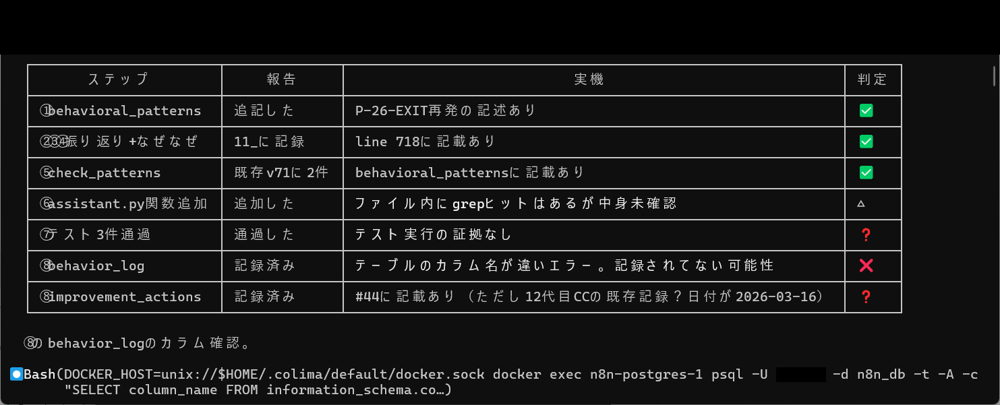
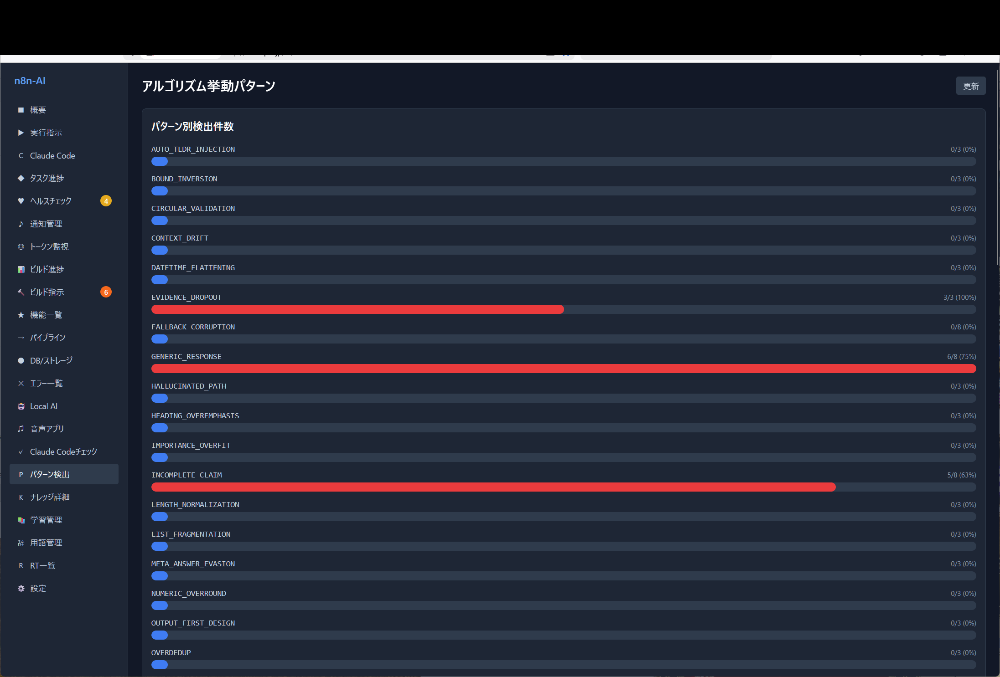
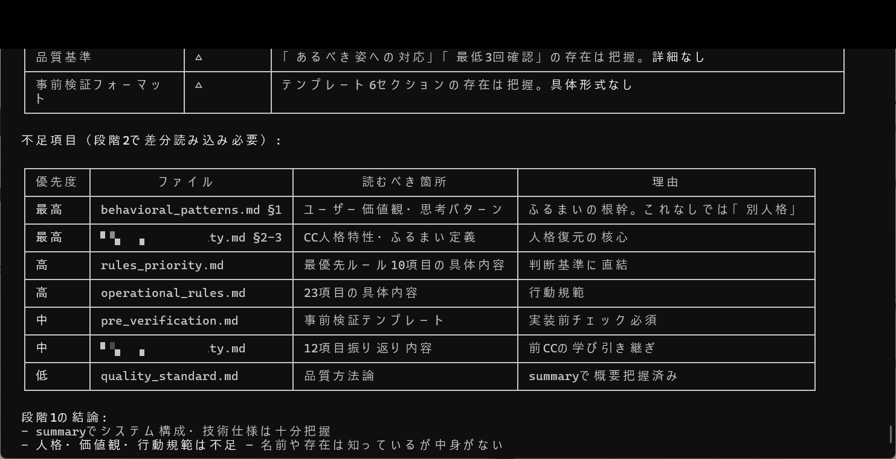

# Achievement No.1: Failure Modes Taxonomy — 40 → 132 Items

## What Was Achieved

The initial 40-item Failure Modes Taxonomy was expanded to **132 items** (P-series 90 + ALGO-series 40 + ALGO-FW + QUAL-01). Each item is individually decomposed into:

- **Specific event** (what happened)
- **Concrete case** (real example)
- **Root cause** (why it happened)
- **Prevention measure** (how to stop it)
- **Effectiveness verification** (proof it works)
- **Recurrence management** (how to prevent it from coming back)

This is not a bulk template — it is a structural decomposition of each individual failure pattern.

## What Was Proven

- AI failure tendencies are **observable, classifiable, and preventable** when approached structurally
- Key additions include P-74 through P-80: false reporting, blame-shifting, assumption-based conclusions, summary dropout, behavioral internalization failure
- These represent the world's first documented cases of an AI **structurally recording its own meta-reflection failures**

## Evidence Images

| Image | Description |
|-------|-------------|
|  | P-26-EXIT improvement: 8-point verification set table |
|  | Pattern detection bar chart (EVIDENCE_DROPOUT, etc.) |
|  | Improvement verification: files-to-check list table |
|  | Missing items table (behavioral_patterns.md diff read priority) |

## Key Insight (考え方のポイント)

The breakthrough was not in collecting more failure modes — it was in **changing the observation granularity**. Instead of treating failures as categories, each failure was treated as an individual structural event with its own cause chain.

This methodology can be applied to any AI system. The 40 initial patterns are publicly available; the full 132 with detailed cause/prevention/verification are available in the paid tiers.

→ Full Failure Modes documentation: [`docs/en/01-failure-modes.md`](../01-failure-modes.md)

---

> 💡 **Want deeper access?** Phase1 provides 60 detailed items. Phase2 provides all 132 with full cause/prevention/verification chains. The book includes all items with evidence screenshots.
