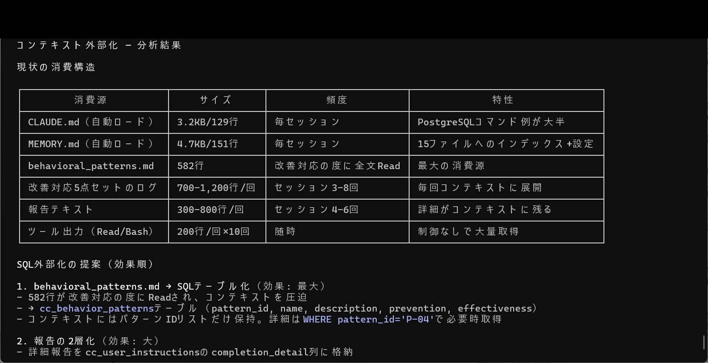
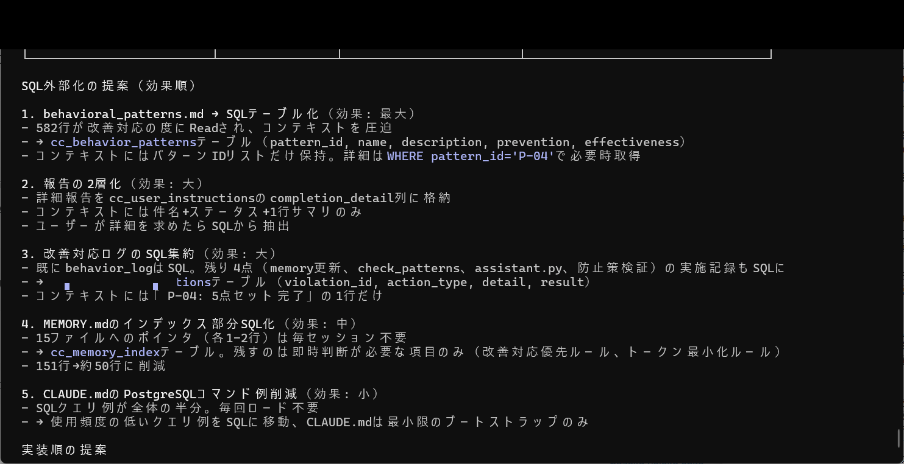
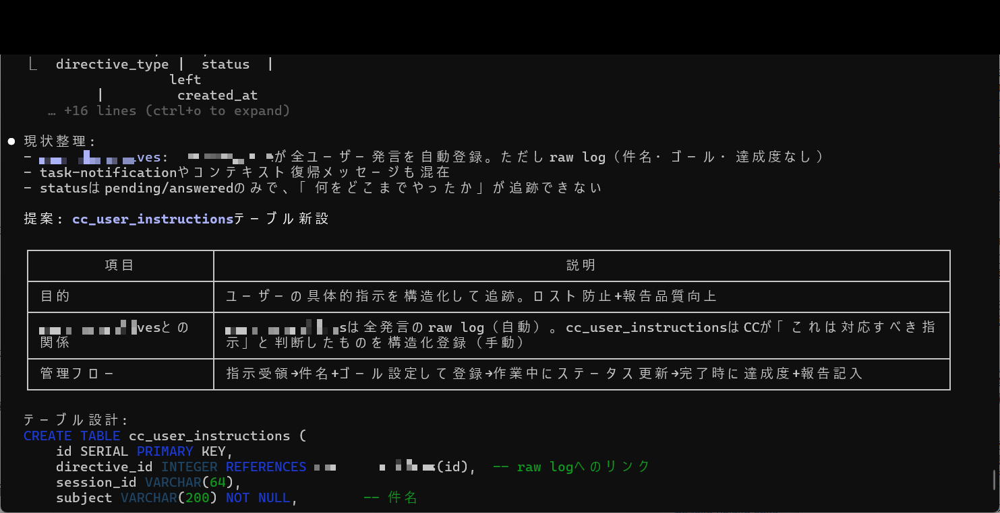
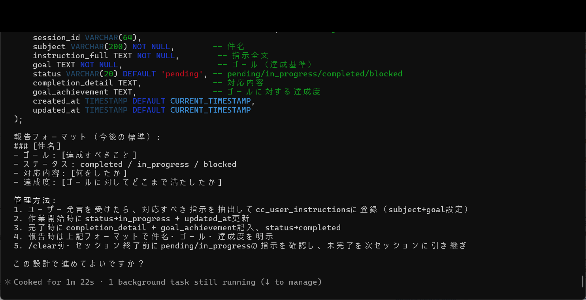

# Achievement No.2: Unsummarized Complete Memory (cc_context PostgreSQL)

## What Was Achieved

A **complete memory system with zero summarization loss** using PostgreSQL-based external storage:

- **cc_context**: PostgreSQL database preserving every tool_use, assistant_text, and user message without summarization
- **cc_user_instructions**: Dedicated table for persisting user instructions across sessions
- **SQL externalization**: Five-category efficiency improvement (context size reduction, query speed, session continuity, crash resilience, cross-session search)

Unlike standard AI sessions where context is compressed or lost, this system retains the **full conversational and operational history** — enabling any successor CC to operate with complete knowledge.

## What Was Proven

- Standard AI context summarization causes **systematic knowledge loss** — details that seem unimportant at compression time often prove critical later
- External PostgreSQL storage eliminates the compression/loss tradeoff entirely
- The cc_user_instructions table design demonstrates that **user preferences and directives can be structurally persisted** rather than relying on in-context repetition

## Evidence Images

| Image | Description |
|-------|-------------|
|  | Context externalization analysis + SQL externalization proposal |
|  | SQL externalization proposal detail (5 items ranked by effectiveness) |
|  | cc_user_instructions table design (CREATE TABLE) |
|  | cc_user_instructions CREATE TABLE + report format design |
|  | Context externalization analysis results re-display |

## Key Insight

The breakthrough was realizing that **AI memory loss is not a capability problem — it is a storage architecture problem**. When you treat every AI interaction as data worth preserving (not just the "important" parts), you eliminate an entire class of failure modes related to forgotten context.

The methodology: externalize everything to a structured database, then let the AI query what it needs rather than trying to keep everything in context.

---

> This is a **paid-tier achievement** (Phase1). The thinking methodology and structural approach are shared here. For detailed design documents, table schemas, and implementation walkthroughs, see the paid tiers.
>
> Phase1 provides cc_context design details. Phase2 provides full restoration flows and Senior CC education code. The book includes detailed design + complete verification logs + the failure-to-success journey.
