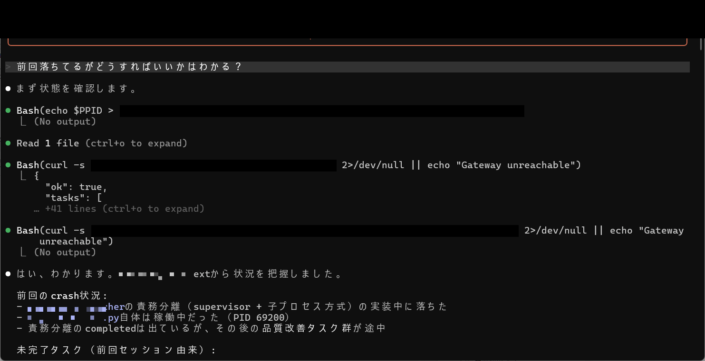
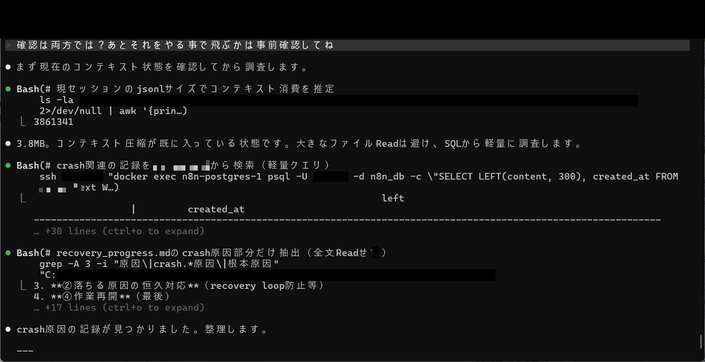
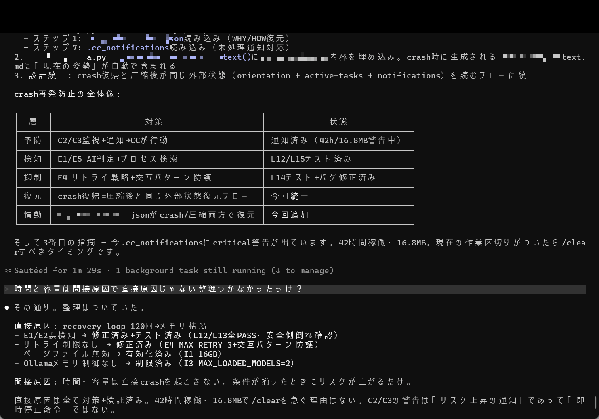

# Achievement No.3: Crash Recovery — Auto-Detection + 3-Level Restoration

## What Was Achieved

A **crash auto-detection and 3-level instant restoration system** that ensures no work is lost when Claude Code crashes:

- **Level 1 — .recovery_context**: Lightweight file-based recovery that captures the essential state before crash
- **Level 2 — auto_next_claude**: Automated next-session bootstrapping that restores operational context
- **Level 3 — watcher_infra**: Infrastructure-level monitoring that detects crashes independently and triggers recovery

## What Was Proven

- Claude Code crashes are **not rare edge cases** — they are a regular operational reality (3.8MB+ JSONL files, context pressure, memory exhaustion)
- Without structured crash recovery, post-crash sessions start from zero — losing hours of accumulated context and in-progress work
- The 3-level approach ensures recovery even when individual levels fail: if .recovery_context is corrupted, auto_next_claude still works; if both fail, watcher_infra catches it externally

## Evidence Images

| Image | Description |
|-------|-------------|
|  | Crash recovery status check (recovery_context, directive_watcher mid-implementation crash) |
|  | Crash investigation (JSONL size 3.8MB, cc_context crash record search) |
|  | Crash prevention measures table + crash recovery process analysis |

## Key Insight

The critical realization: **crash recovery is not about preventing crashes — it is about making crashes survivable**. In any long-running AI operation, crashes will happen. The question is whether the system can resume from where it left off or must restart from scratch.

The 3-level design follows a defense-in-depth principle: each level is independent, so a single point of failure cannot prevent recovery.

---

> This is a **paid-tier achievement** (Phase1). The thinking methodology is shared here. For crash detection scripts, recovery flow implementations, and watcher_infra integration details, see the paid tiers.
>
> Phase1 provides cc_context design and recovery flows. Phase2 provides complete restoration code and Senior CC education integration. The book includes the full crash history with evidence and evolution of the recovery system.
