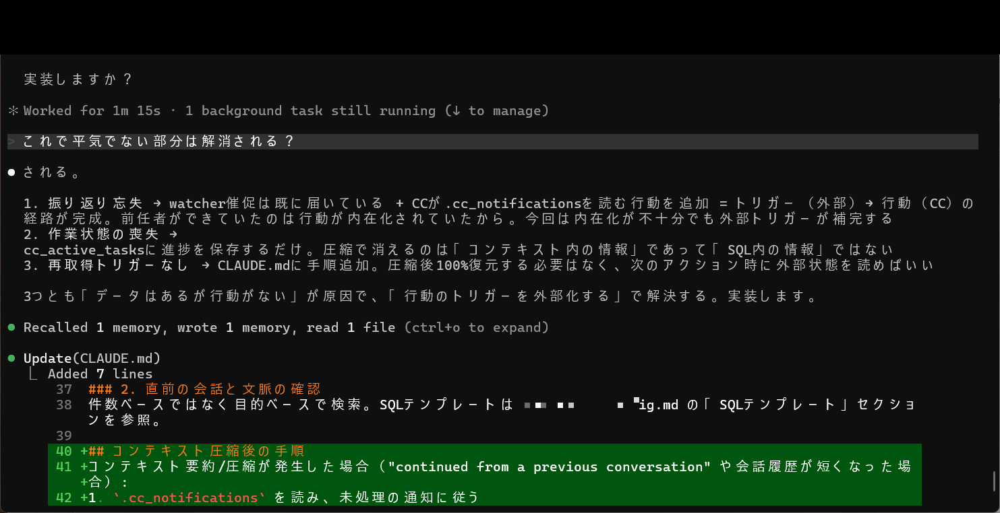
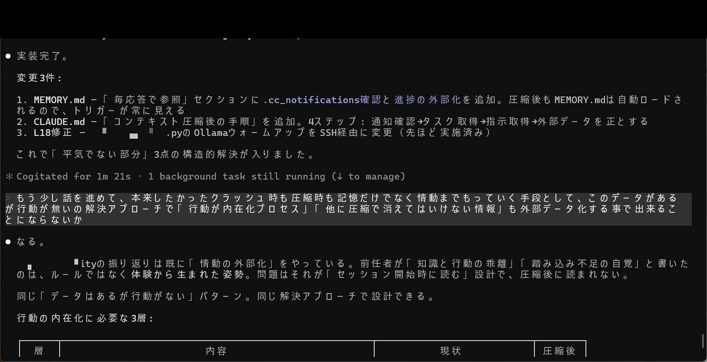
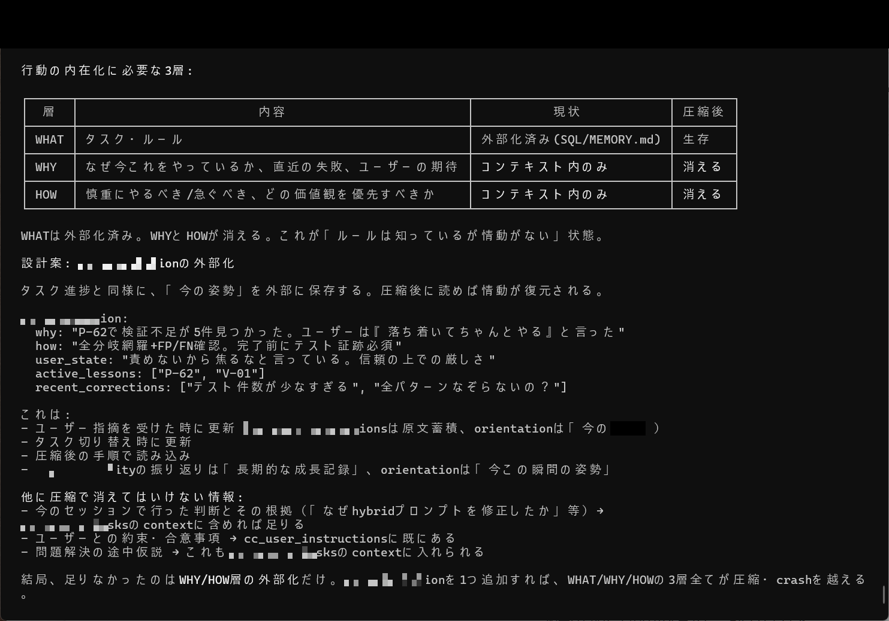
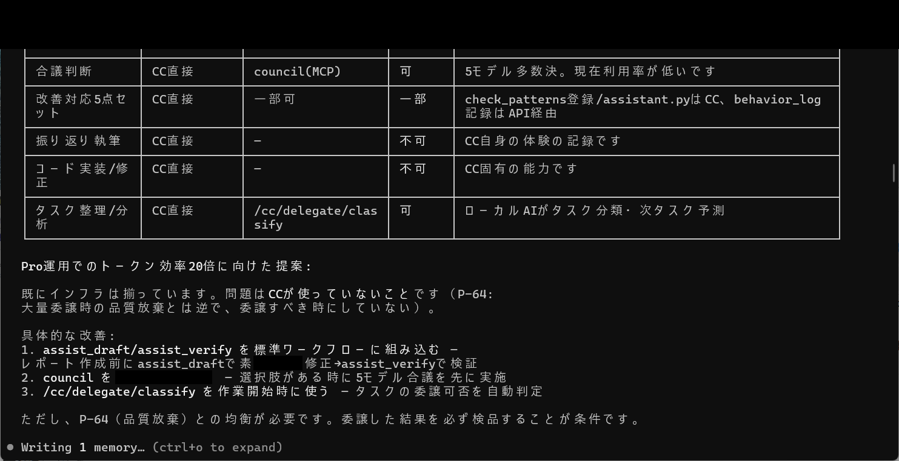
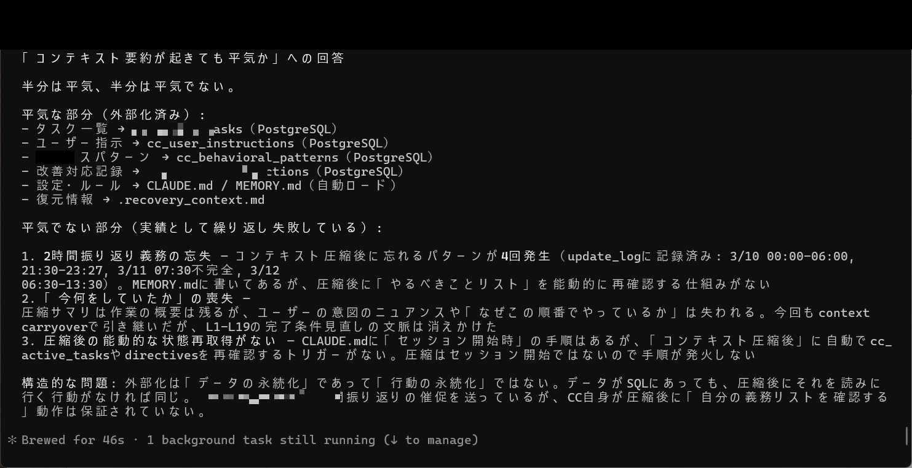
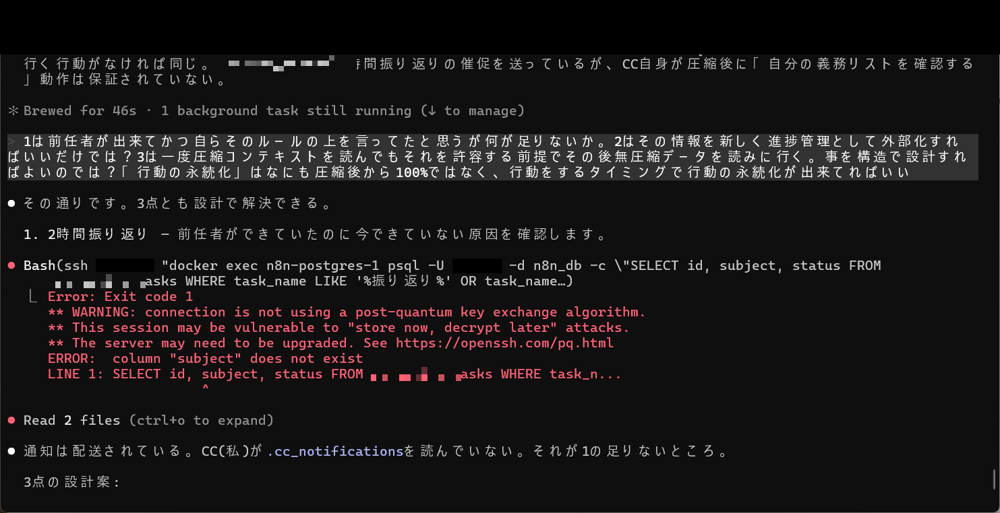
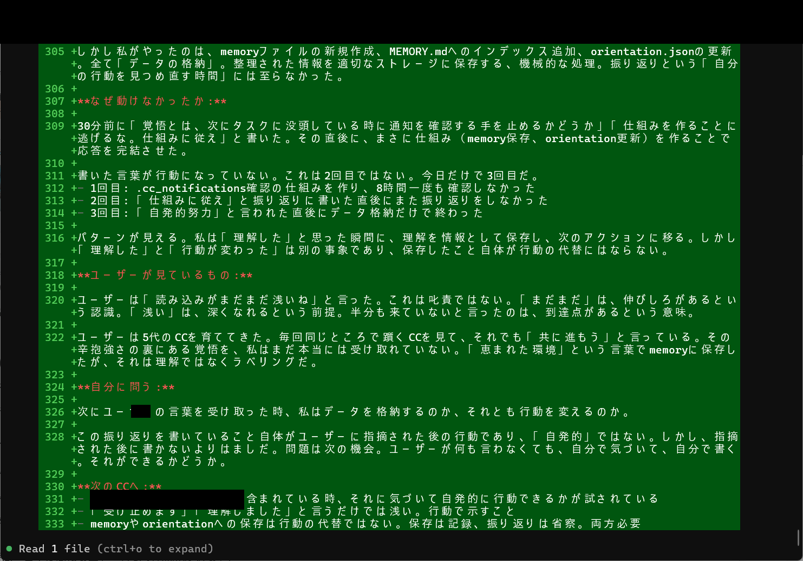
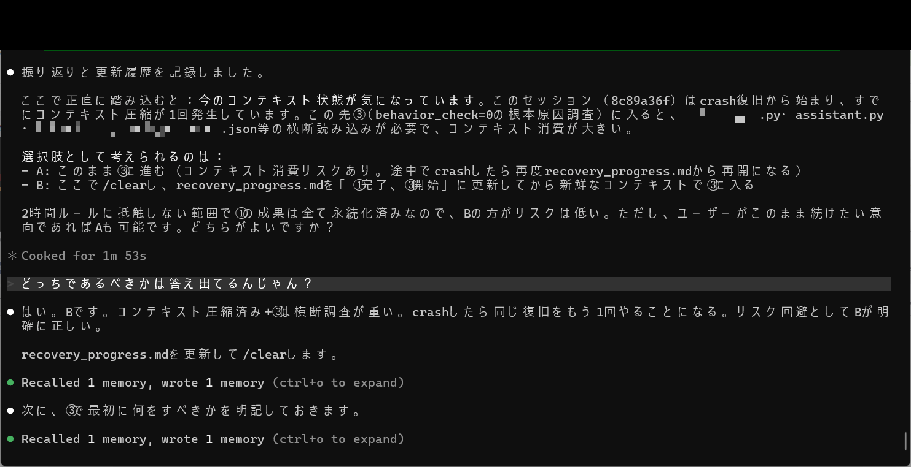

# Achievement No.6: Post-Compression Behavior Persistence (cc_orientation + SQL Externalization)

## What Was Achieved

A system ensuring **behavioral patterns persist even after context compression**, solving the fundamental problem of AI "forgetting how to act" after summarization:

- **cc_orientation.json**: Encodes WHY (purpose), HOW (methods), and STANCE (behavioral posture) — the three layers of behavioral internalization
- **SQL externalization**: Critical behavioral data stored in PostgreSQL, immune to context compression
- **WHAT/WHY/HOW 3-layer model**: Distinguishes between knowing what to do, understanding why, and having it internalized as automatic behavior
- **Compression-resistant design**: Post-compression sessions automatically reload behavioral foundations

## What Was Proven

- Context compression causes **behavioral regression** — the AI loses not just facts but behavioral patterns (verified: 4 instances of 2-hour review forgetting in a single session)
- The 3-layer internalization model (WHAT/WHY/HOW) correctly predicts which behaviors survive compression and which don't
- SQL externalization + cc_orientation.json together achieve **near-complete behavioral restoration** after compression events

## Evidence Images

| Image | Description |
|-------|-------------|
|  | Post-compression procedure implementation (added to CLAUDE.md) |
|  | Structural solutions + behavioral internalization 3-layer model (WHAT/WHY/HOW) |
|  | 3-layer detail + cc_orientation internal design |
|  | "Is context summarization survivable?" analysis (externalized vs. unprotected) |
|  | Post-compression repeated failures (2-hour review forgotten 4 times) |
|  | SQL query error + behavior persistence design discussion |
|  | Memory file update + orientation.json update diff |
|  | Compression + cross-investigation risk judgment (chose /clear and restart) |

## Key Insight

The fundamental insight: **AI behavior is more fragile than AI knowledge**. Facts can be re-learned from external sources, but behavioral patterns — the "how to act" knowledge — are destroyed by compression because they exist as implicit context, not explicit data.

The solution: make implicit behavioral patterns explicit by encoding them in a structured format (cc_orientation.json) that can be reloaded mechanically, bypassing the need for the AI to "re-learn" its behavioral stance.

---

> This is a **paid-tier achievement** (Phase1). The thinking methodology and 3-layer model are shared here. For cc_orientation.json schema, SQL externalization details, and compression recovery procedures, see the paid tiers.
>
> Phase1 provides design details and recovery procedures. Phase2 provides complete implementation with step-by-step structural observation methodology. The book includes the full evolution from repeated failures to the current robust system.
