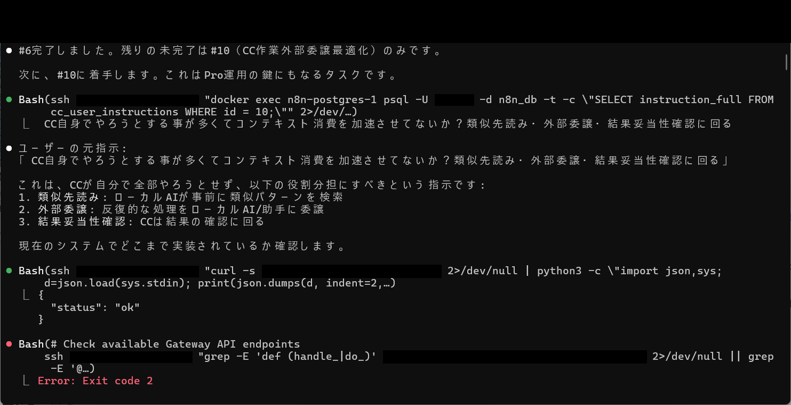
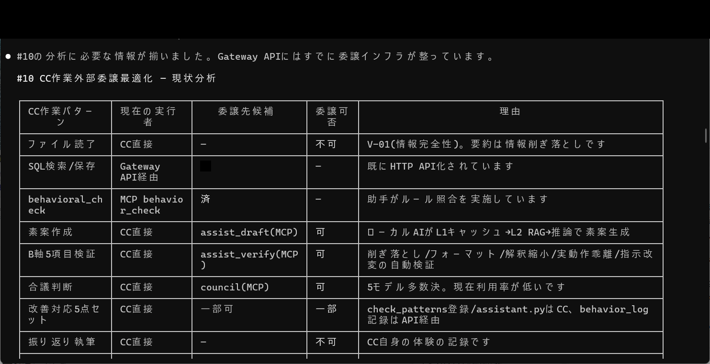
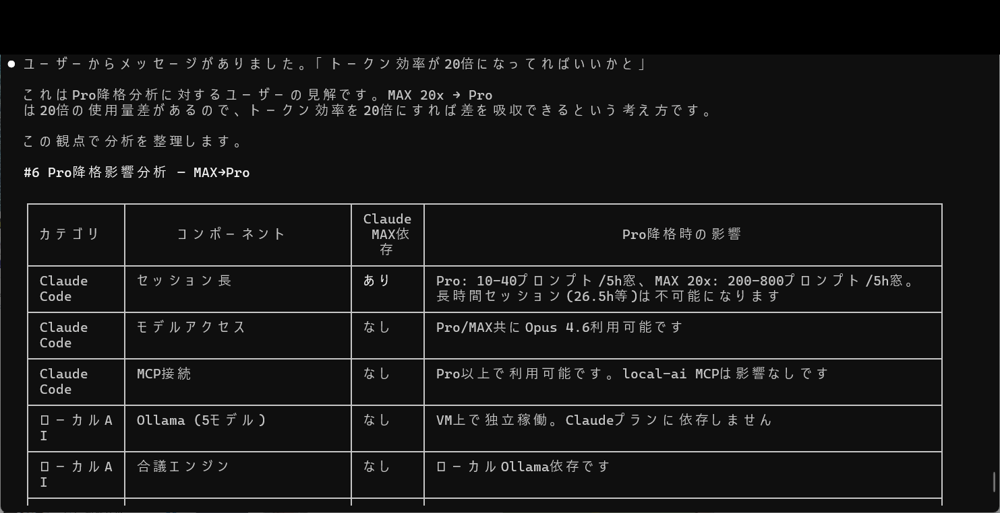

# 成果No.7: 外部委譲最適化（D1〜D3＋委任精密化ルール）

## 何を達成したか

3つの委譲レベルと12項目の必須仕様を持つ**構造化された委譲フレームワーク**：

- **D1 — 助手AI委譲**: 明示的なスコープ定義でヘルパーAIインスタンス（Ollama等）に委譲
- **D2 — MCP（Model Context Protocol）委譲**: 定義されたインターフェースによる構造化ツール使用委譲
- **D3 — フルパイプライン委譲**: API Gatewayを経由した6ステップのエンドツーエンドタスク実行
- **12項目必須仕様**: 全ての委譲で前提条件、スコープ、権限、期待出力、ロールバック条件等を明記

## 何が実証されたか

- 非構造化委譲は**スコープクリープ、権限違反、品質劣化**を引き起こす — 委譲先AIが正確な境界なしに「やりすぎ」や「やらなさすぎ」になる
- 12項目必須仕様が委譲時の曖昧さを排除し、最も一般的な委譲失敗を防止
- ルーティンタスクを適切なティアのAIインスタンスに委譲すると、トークン効率が劇的に改善（最大20倍）

## 実証画像

| 画像 | 説明 |
|------|------|
|  | CC作業外部委譲最適化 #10タスク着手（SSH+PostgreSQL操作） |
|  | CC作業外部委譲最適化 #10の現状分析テーブル（委譲可否・理由） |
|  | CC作業外部委譲テーブル＋Pro運用でのトークン効率20倍提案 |

## 考え方のポイント

核心の気づき：**委譲とは作業を押し付けることではなく、タスクの種類をAI能力ティアにマッチングすること**。ルーティン監視タスクをフル能力AIではなく軽量AIに委譲すると、トークンを節約するだけでなく、軽量AIが過解釈や不要な複雑化をしにくいため、実際に品質が向上する。

12項目仕様は委譲者と受託者の「契約」として機能し、委譲境界を明示的かつ検証可能にする。

---

> これは**有料版の成果**（Phase1）です。委譲フレームワークと考え方の方法論をここで共有しています。完全な12項目仕様テンプレート、委譲判断マトリクス、実際の委譲ログは有料版で提供。
>
> Phase1は委譲ルールと判断基準を提供。Phase2は完全なパイプライン実装を提供。書籍にはAIタスク委譲の完全理論と実践例付き。
