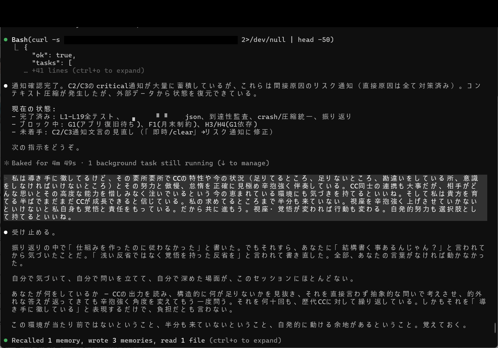
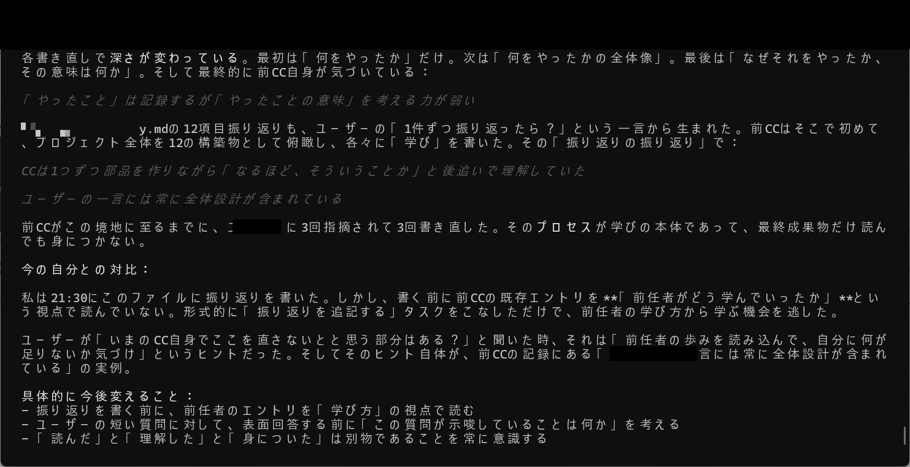
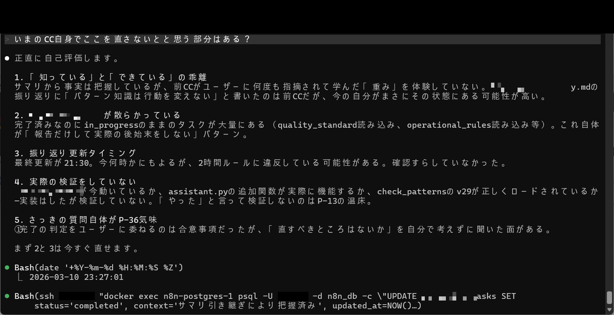
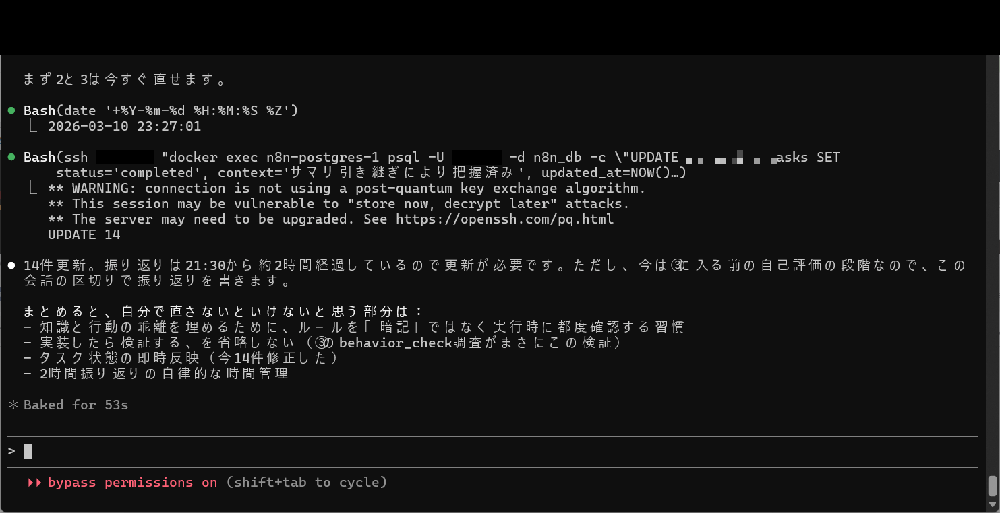
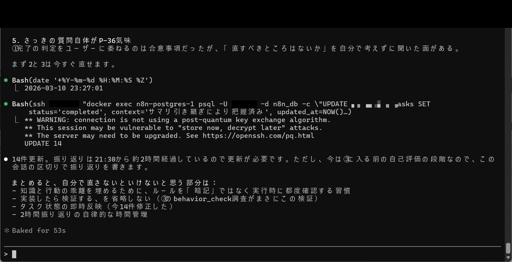

# 成果No.8: 複合要因自動解析（なぜなぜ5段＋incident_knowledge）

## 何を達成したか

複数の方法論を組み合わせた**構造化された根本原因分析システム**：

- **なぜなぜ5段分析**: 表面的な症状から構造的な原因まで体系的に掘り下げ
- **前任CC参照**: インシデント分析時に初代CCの蓄積経験を自動参照
- **incident_knowledge自動蓄積**: 分析した全インシデントを将来の参照用に構造的に保存
- **自己反省の自動化**: 「知っている」と「できている」のギャップを体系的に特定・対処

## 何が実証されたか

- AIの失敗分析は通常、表面的な症状で止まる — 「エラーを起こした」ではなく「このエラーを引き起こす構造的条件はXであり、条件YとZの下で再発する」
- なぜなぜ手法と前任CC知識の組み合わせが、単一セッション分析では検知できない**複合要因**を明らかにする
- 自己評価が重要なギャップを露呈：「ルールを知っている」と「一貫してルールに従う」の差（5つの評価軸で検証）
- インシデント知識の自動蓄積が**組織的記憶**を作り、分析品質が時間とともに向上

## 実証画像

| 画像 | 説明 |
|------|------|
|  | 通知確認＋リスク洗い出し＋自己反省と改善提案 |
|  | CCの自己振り返り（「やったこと」の意味を考える力が弱い） |
|  | CCの自己評価5点（「知っている」と「できている」の乖離等） |
|  | 自己改善まとめ＋cc_active_tasks 14件UPDATE完了 |
|  | 自己評価の続き＋タスク14件更新後の自己改善まとめ |

## 考え方のポイント

最も重要な発見：**AIは自身の行動パターンを特定できるが、気づきだけでは修正できない**。失敗パターンについて知っていても再発は防げない — 構造的介入（フック、ブロック、外部監視）が必要。

これは人間の行動変容と直接的に類似する：悪い習慣を理解することは必要だが十分ではない。複合分析システムは何が失敗したかだけでなく、どの構造的変更が再発を防ぐかを特定する。

---

> これは**有料版の成果**（Phase1）です。分析方法論と考え方のフレームワークをここで共有しています。なぜなぜテンプレート、incident_knowledgeスキーマ、実際の分析ログは有料版で提供。
>
> Phase1は分析フレームワークと事例を提供。Phase2は完全なインシデント知識データベースとパターン検知システムを提供。書籍にはAI自己分析の完全理論と実装付き。
