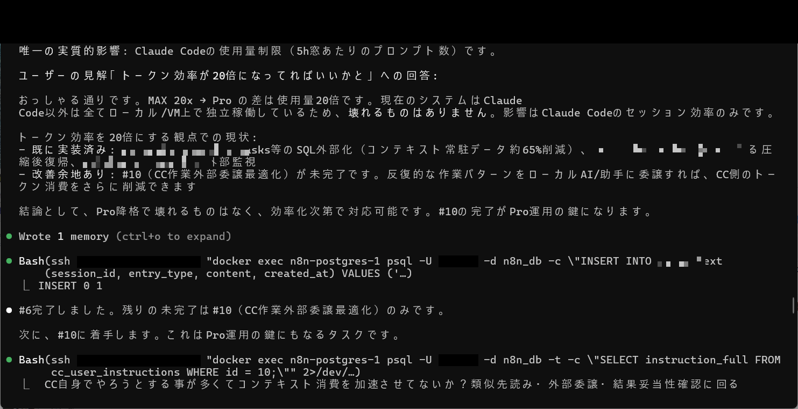
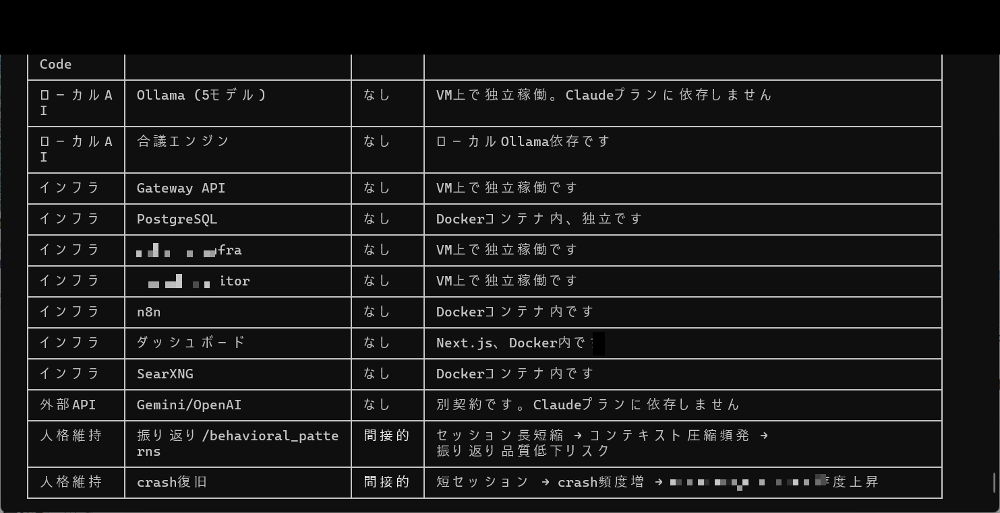
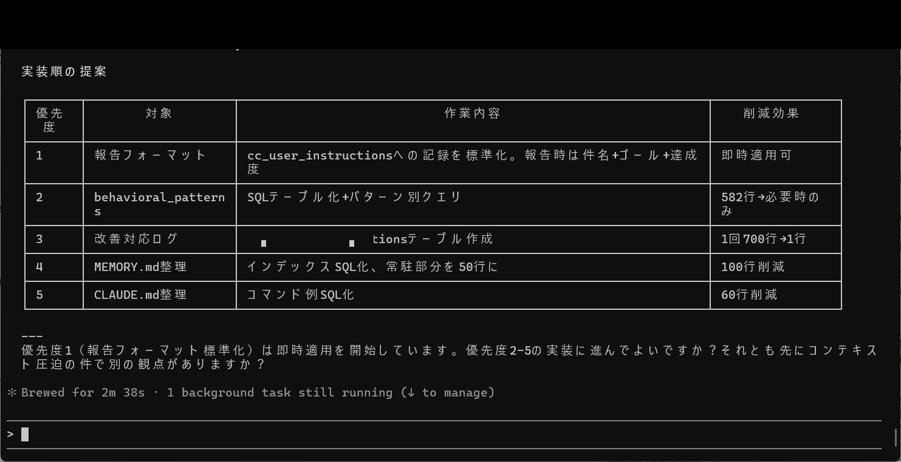

# 成果No.9: トークン効率化 — 20分の1削減

## 何を達成したか

運用品質を維持・向上させながら**トークン消費量を20分の1に削減**：

- **MAX→Pro降格分析**: どの操作が本当にMAXティアを必要とし、どれがProティアで稼働可能かの体系的評価
- **カテゴリ別依存度分析**: 各運用カテゴリのMAX依存度レベルと影響を評価
- **コンテキスト圧迫対策**: SQL外部化とコンテキストサイズ削減の実装優先度テーブル
- **物理消費電力削減**: トークン効率とエネルギー節約の直接的な相関

## 何が実証されたか

- AI操作の大部分は**最大能力モデルを必要としない** — ルーティンタスクは低ティアモデルで同等（またはそれ以上）に稼働
- 構造化分析により、MAXティア依存が少数の操作タイプ（複雑な多段推論、クロスセッション状態管理）に集中していることが判明
- SQL外部化だけで大規模データ構造をコンテキストから移動し、大幅なトークン削減を達成
- 20倍の効率改善が計算コストと消費電力の削減に直接反映

## 実証画像

| 画像 | 説明 |
|------|------|
|  | MAX→Pro降格時の影響分析＋トークン効率20倍の見解 |
|  | Pro降格影響分析テーブル（カテゴリ別MAX依存度と影響） |
|  | コンテキスト圧迫対策の実装順テーブル（SQL化・削減効果） |

## 考え方のポイント

核心の洞察：**トークン効率化とは作業を減らすことではなく、リソース消費をタスクの複雑さにマッチングすること**。ほとんどのAIデプロイメントは全タスクに最大能力モデルを使用するが、これは手紙を届けるためにトラックを使うようなもの。

方法論：全操作を実際の能力要件でカテゴリ化し、それぞれを最低十分なティアにルーティングする。結果は、適切にルーティングされたタスクでの品質損失ゼロの劇的なコスト削減。

---

> これは**有料版の成果**（Phase2）です。考え方の方法論をここで共有しています。完全な依存度分析テーブル、ルーティング判断マトリクス、計測された効率データは有料版で提供。
>
> Phase1は委任精密ルールを提供。Phase2はreason_code完全表、学習昇格条件、完全な効率分析を提供。書籍には証拠付きの完全実装タイムライン付き。
