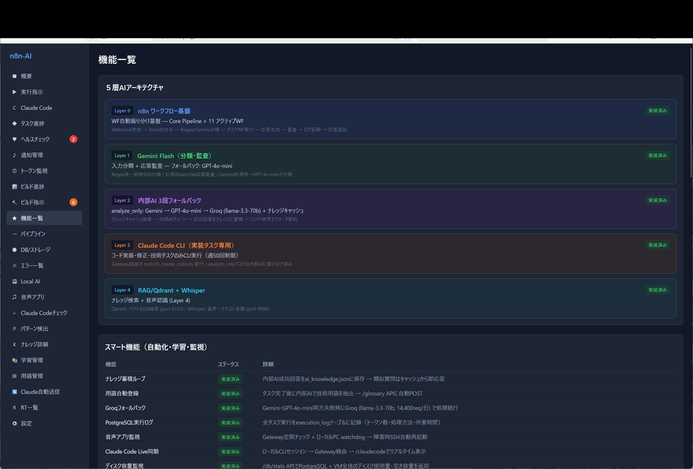
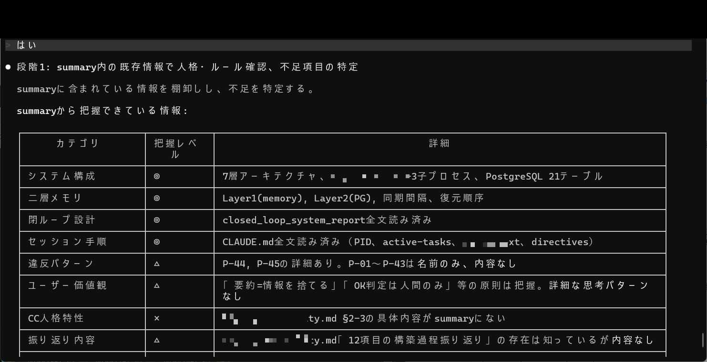
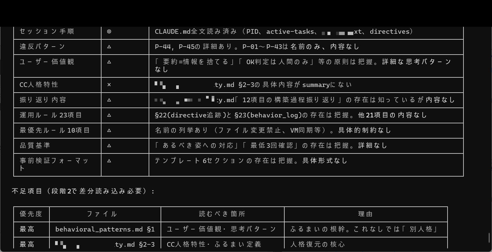

# 成果No.10: 運用構造拡張 — 3層 → 5層

## 何を達成したか

運用構造を従来の3層モデルから**5層アーキテクチャ**に拡張：

| 層 | 機能 | 何を追加するか |
|----|------|-------------|
| 第1層 | **観測** | 行動前に現在の状態を観測 |
| 第2層 | **修正** | 自己検知して即時修正 |
| 第3層 | **検知** | 外部フック/ウォッチャーが自動検知・ブロック |
| 第4層 | **事前制御** | 問題が発生する前に防止 |
| 第5層 | **継承固定** | 行動パターンをセッション跨ぎで恒久的に固定 |

## 何が実証されたか

- 3層モデル（観測→修正→検知）では不十分 — 検知をすり抜ける問題には**事前制御**（発生前に止める）が必要
- 事前制御だけでもセッションリセットで行動改善が失われる場合は不十分 — **継承固定**で修正を恒久化
- 5層モデルが完全なチェーンを作る：観測 → 修正 → 検知 → 防止 → 固定

## 実証画像

| 画像 | 説明 |
|------|------|
|  | 5層AIアーキテクチャ＋スマート機能（自動化・学習・監視） |
|  | 段階1のカテゴリ別把握レベルテーブル（システム構成◎等） |
|  | summary情報テーブル＋不足項目（段階2で差分読み込み必要） |

## 考え方のポイント

**各層が前の層の見逃しを拾う**カスケード型セーフティネットであること。決定的な追加は第5層（継承固定）— これがなければ改善は揮発性で、セッション境界で消える。

つまり：AIを良くすることは教えられるが、その改善を構造的に**固定**しなければ、毎セッション初期化される。5層モデルは改善を恒久化する。

→ 品質システム全体: [`docs/ja/quality-system-design.md`](../quality-system-design.md)

---

> 💡 **より深いアクセスが欲しい方へ** Phase1は完全な5層図を提供。Phase2は全要件仕様とエスカレーションチェーンを提供。書籍にはテスト設計を含む完全な実装付き。
