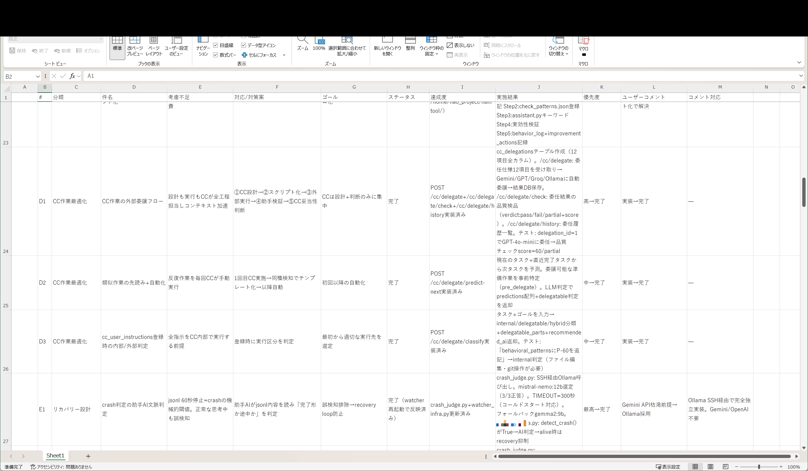

# 成果No.14: 品質管理システム（4+1層アーキテクチャ）

## 何を達成したか

**4+1層アーキテクチャ**に基づく包括的な品質管理システム：

| 層 | 名称 | 責任 |
|----|------|------|
| Layer 0 | **観測ゲート** | 実行前：現在の状態を観測、目標定義、承認取得 |
| Layer 1 | **自己** | 自己検知＋即時修正 |
| Layer 2 | **構造** | フック/ウォッチャーが自動検知＋ブロック |
| Layer 3 | **完了定義** | エビデンス＋5セット検査 |
| Layer 4 | **第三者検証** | パターンエスカレーション＋インシデント記録＋学習制御 |

追加コンポーネント：
- **reason_codeシステム**: 全品質問題を構造化された理由コードで分類
- **5セット必須検査**: 前提条件、禁止事項、実行観測、PASS基準、ロールバック
- **エスカレーションチェーン**: 自己検知→構造ブロック→第三者レビューへの自動エスカレーション

## 何が実証されたか

- 品質はどの単一層でも維持できない — 各層が前の層の見逃しを拾う**カスケード型検証**が必要
- reason_codeシステムが曖昧な品質クレームを**実行可能・追跡可能なカテゴリ**に変換
- 5セット検査により「完了」を客観的に検証可能にし、エビデンスなしの「できたと思う」という一般的な失敗を排除

## 実証画像

| 画像 | 説明 |
|------|------|
|  | スプレッドシート形式データ一覧（品質向上コメント視点） |

## 考え方のポイント

品質システムは理論的に設計されたのではない — **実際の失敗を通じて進化**した。各層は、実際のインシデントが前の層の不十分さを証明したことで追加された。

最も重要な洞察：**品質はチェックリストではなく、多層防御**であり、各層が構造的に異なる検知メカニズムを持つ。自己監視は明白なエラーを捕捉し、構造フックは自己監視の見逃しを捕捉し、完了定義はフックの見逃しを捕捉し、第三者検証はシステム的パターンを捕捉する。

→ 品質システム全体ドキュメント: [`docs/ja/quality-system-design.md`](../quality-system-design.md)

---

> 💡 **より深いアクセスが欲しい方へ** Phase1はreason_code表と5セット検査の詳細を提供。Phase2は全要件仕様とエスカレーションチェーン定義を含む完全なquality_system_designを提供。書籍にはテスト設計と進化の歴史を含む完全実装付き。
