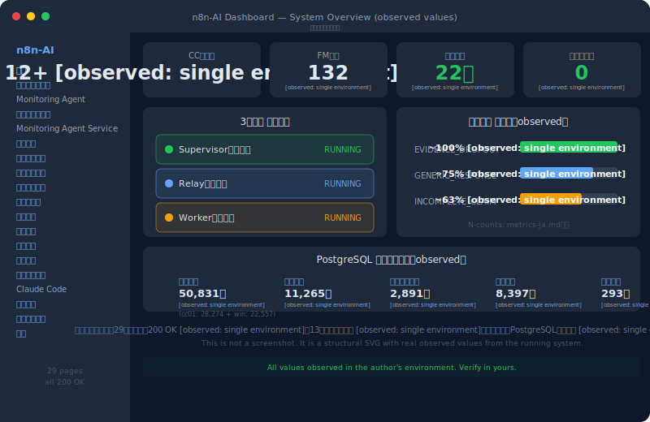

# 成果No.1: Failure Modes体系の拡張
Language: [English version](../../../20-proof/achievements/01-failure-modes-132.md)

 

## 何が観測されたか

AIの繰り返し失敗を、孤立したバグではなく構造的インシデントとして扱うべき理由を知りたい場合は、このページから始めてください。

著者の運用環境において、初期40件のFailure Modes分類を**132件** [observed: single environment, single operator]に拡大（P系90 + ALGO系40 + ALGO-FW + QUAL-01）。各項目を個別に分解：

- **具体的事象**（何が起きたか）
- **具体的事例**（実例）
- **根本原因**（なぜ起きたか）
- **防止策**（どう止めるか）
- **実効性検証**（効果の証拠）
- **再発管理**（再発防止の仕組み）

一括回避テンプレではなく、個別事象の構造解剖＋予防策の自発的設計への完全移行。

## 観測されたこと

- AIの失敗傾向は、構造的にアプローチすれば**観測可能・分類可能・予防可能**であることが観測された
- P-74〜P-80の追加：虚偽報告、責任転嫁、思い込み結論、要約脱落、行動内面化失敗
- これらはAIが**自身のメタ反省失敗を構造的に記録**した事例として、著者の環境で観測された

## 考え方のポイント

> 以下は著者の観測環境で観測された傾向を示します：

構造的な転換点は失敗モードをもっと集めたことではなく、**観測の粒度を変えた**こと。失敗をカテゴリとして扱うのではなく、個別の構造的事象として、それぞれ独自の原因チェーンを持つものとして扱った。

この方法論は多くのAIシステムへ移植可能な形を目指していますが、適用可否は各環境で検証してください。最初の40パターンは公開版として提供中。全件の詳細は将来の公開フェーズで提供予定（SCOPE-MATRIX-ja.md 参照）。

→ Failure Modes詳細ドキュメント: [`10-framework/01-failure-modes-ja.md`](../../10-framework/01-failure-modes-ja.md)

---

> 公開版では初期公開範囲を提供し、全件詳細は将来の公開フェーズで段階的に提供予定。

> **注記**: Phase 1 / Phase 2 は将来の公開フェーズであり、価格帯ではありません。[SCOPE-MATRIX-ja.md](../../SCOPE-MATRIX-ja.md) を参照。

---

→ [READMEに戻る](../README-ja.md)
---
*この文書は [SHI-Claude-Control-OS](https://github.com/naoyukioyama561-alt/SHI-Claude-Control-OS) プロジェクトの一部です。*
