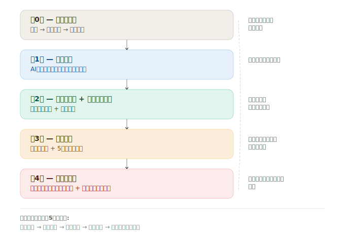

# 成果No.4: 品質システム（4+1層アーキテクチャ）
Language: [English version](../../../20-proof/achievements/04-quality-system.md)

 

> *注: `[internal quality hook]` は安全な公開のため墨消しした内部名称です。詳細は [SCOPE-MATRIX-ja.md](../../SCOPE-MATRIX-ja.md) を参照してください。*

## 何が観測されたか

**4+1層アーキテクチャ**に基づく品質システム：

| 層 | 名称 | 責任 |
|----|------|------|
| Layer 0 | **観測ゲート** | 実行前：現在の状態を観測、目標定義、承認取得 |
| Layer 1 | **自己** | 自己検知＋即時修正 |
| Layer 2 | **構造** | フック/ウォッチャーが自動検知＋ブロック |
| Layer 3 | **完了定義** | エビデンス＋5セット検査 |
| Layer 4 | **第三者検証** | パターンエスカレーション＋インシデント記録＋学習制御 |

追加コンポーネント：
- **reason_codeシステム**: 全品質問題を構造化された理由コードで分類
- **5セット必須検査**: 前提条件、禁止事項、実行観測、PASS基準、ロールバック
- **エスカレーションチェーン**: 自己検知→構造ブロック→第三者レビューへの自動エスカレーション

## 観測されたこと

- 品質はどの単一層でも維持しにくい -- 各層が前の層の見逃しを拾う**カスケード型検証**が有効であることが観測された
- reason_codeシステムが曖昧な品質クレームを**実行可能・追跡可能なカテゴリ**に変換
- 5セット検査により「完了」を客観的に検証可能にし、エビデンスなしの「できたと思う」という一般的な失敗を低減

## 考え方のポイント

> 以下は著者の観測環境で観測された傾向を示します：

品質システムは理論的に設計されたのではない -- **実際の失敗を通じて進化**した。各層は、実際のインシデントが前の層の不十分さを示したことで追加された。

→ 品質システム全体ドキュメント: [`10-framework/05-quality-system-ja.md`](../../10-framework/05-quality-system-ja.md)

---

> 詳細は将来の公開フェーズで提供予定。[SCOPE-MATRIX-ja.md](../../SCOPE-MATRIX-ja.md) を参照。

> **注記**: Phase 1 / Phase 2 は将来の公開フェーズであり、価格帯ではありません。[SCOPE-MATRIX-ja.md](../../SCOPE-MATRIX-ja.md) を参照。

---

→ [READMEに戻る](../README-ja.md)
---
*この文書は [SHI-Claude-Control-OS](https://github.com/naoyukioyama561-alt/SHI-Claude-Control-OS) プロジェクトの一部です。*
